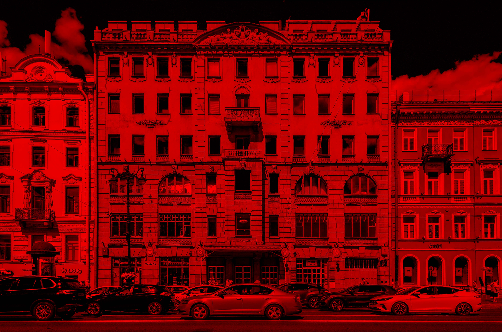
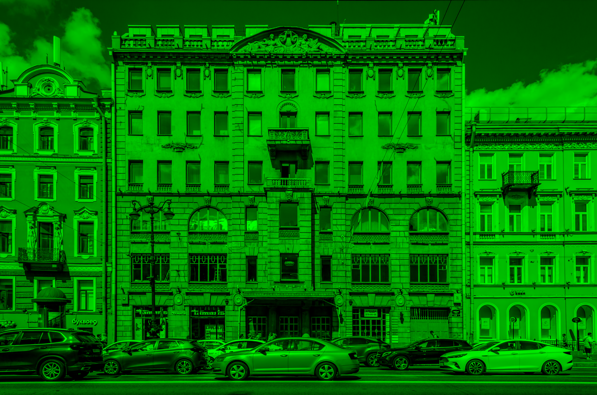
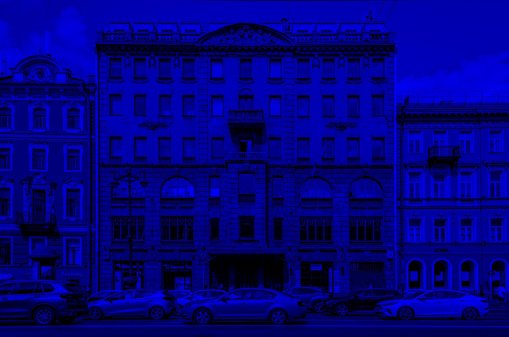
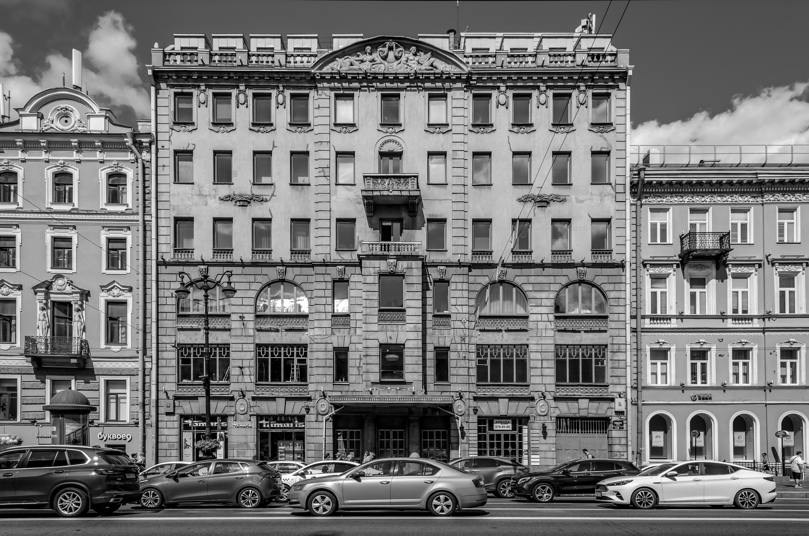
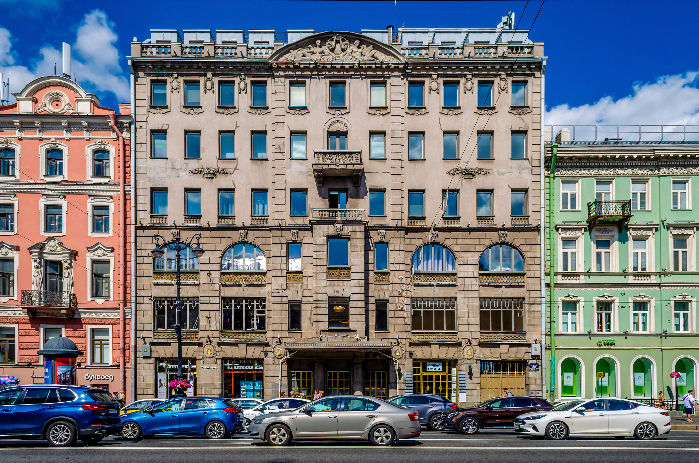
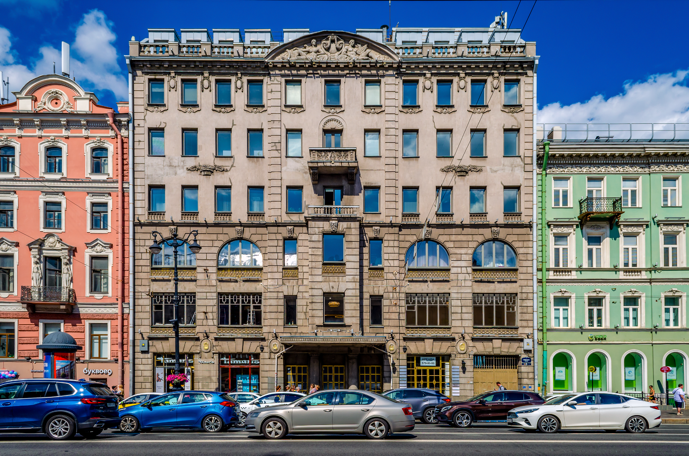

# Лабораторная работа №1
## Цветовые модели и передискретизация изображений

### Исходное изображение

### 1. Цветовые модели

#### 1.1 Компоненты R, G, B

|             Красный канал              |             Зелёный канал              |              Синий канал               |
|:--------------------------------------:|:--------------------------------------:|:--------------------------------------:|
|  |  |  |

#### 1.2 Яркостная компонента HSI

#### 1.3 Инвертирование яркостной компоненты

|            Исходное изображение            |                  С инвертированной яркостью                   |
|:------------------------------------------:|:-------------------------------------------------------------:|
|  |  |

### 2. Передискретизация (M=2, N=3, K=0.75)

#### 2.1 Растяжение в M раз (метод ближайшего соседа)

|                  Исходное                  |                   Растянутое                   |
|:------------------------------------------:|:----------------------------------------------:|
|  |  |

#### 2.2 Сжатие в N раз (метод прореживания)

|                  Исходное                  |                    Сжатое                    |
|:------------------------------------------:|:--------------------------------------------:|
|  |  |

#### 2.3 Двухпроходная передискретизация (растяжение + сжатие)

|                  Исходное                  |             Результат двух проходов             |
|:------------------------------------------:|:-----------------------------------------------:|
|  |  |

#### 2.4 Однопроходная передискретизация (прямое масштабирование)

|                  Исходное                  |            Результат одного прохода             |
|:------------------------------------------:|:-----------------------------------------------:|
|  |  |

### Заключение

Были сделаны:

1. **Цветовые модели RGB и HSI**:
   - Выделены компоненты красного, зелёного и синего каналов
   - Выполнено преобразование RGB → HSI
   - Произведено инвертирование яркостной компоненты

2. **Методы передискретизации**:
   - Реализован метод ближайшего соседа
   - Выполнены операции растяжения (M=2) и сжатия (N=3)
   - Реализована двухпроходная передискретизация: растяжение в M раз с последующим сжатием в N раз
   - Реализована однопроходная передискретизация: прямое масштабирование в K=M/N раз