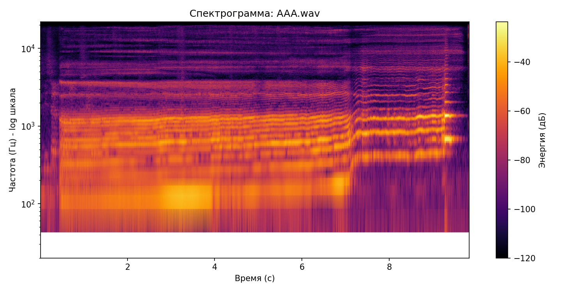
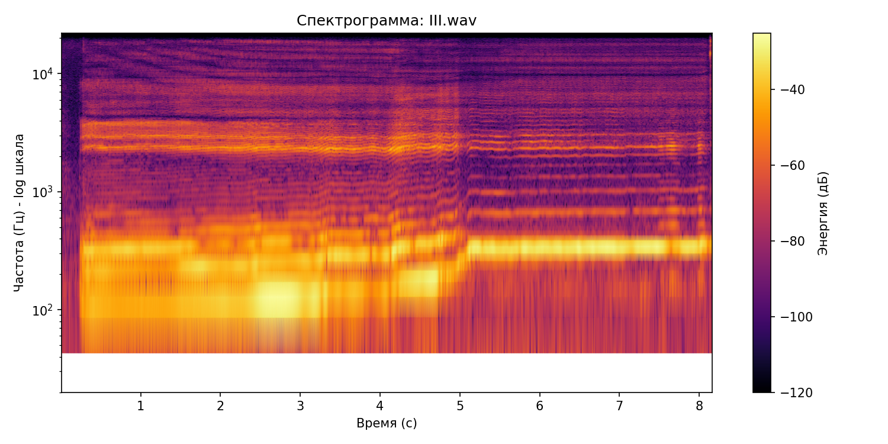
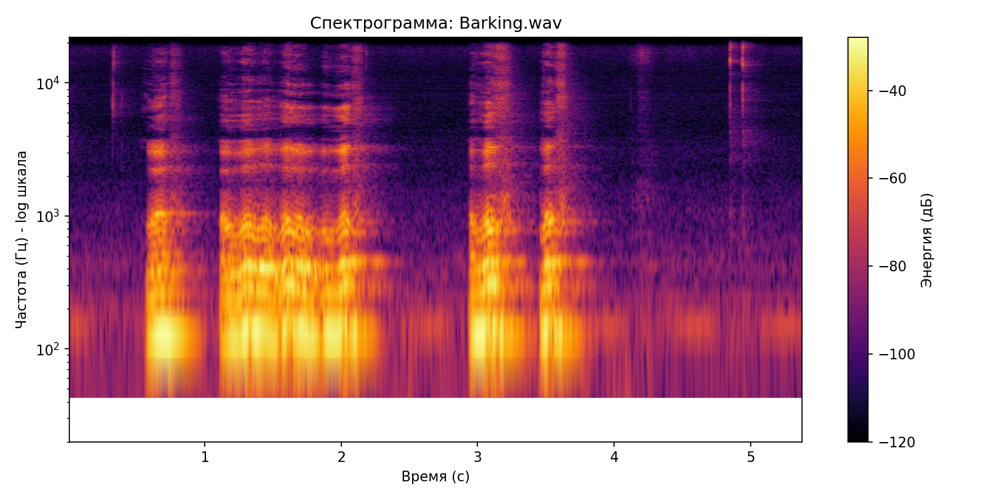
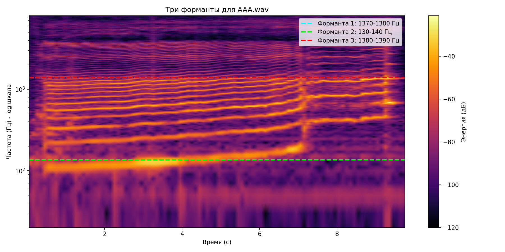
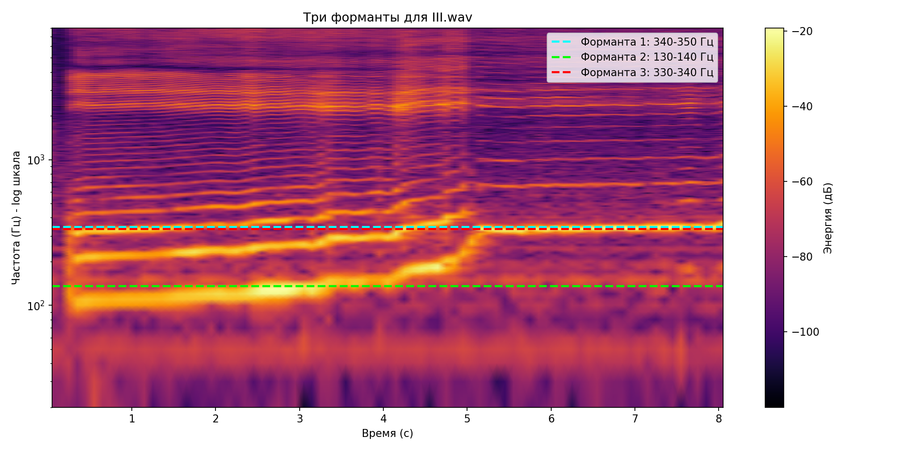
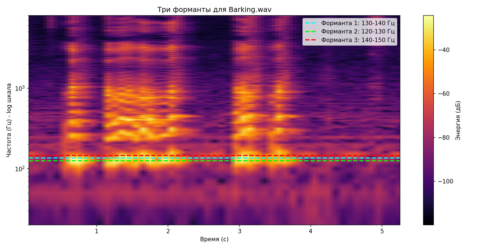

# Лабораторная работа №10. Обработка голоса

## Вариант 1. Голосовой диапазон, тембр, форманты

## 1. Подготовка звуковых дорожек

Были записаны три звуковые дорожки в формате *.wav (моно, частота дискретизации 44100 Гц):

- `AAA.wav` — образец голоса для звука **«А»** с максимальным частотным диапазоном (протяжно от баса до фальцета).
- `III.wav` — образец голоса для звука **«И»** (аналогично).
- `Barking.wav` — имитация собачьего лая.

## 2. Спектрограммы (STFT, окно Ханна)

Построены спектрограммы для каждой дорожки с логарифмической шкалой частот.

**Рис. 1:** Спектрограмма `AAA.wav`

**Рис. 2:** Спектрограмма `III.wav`

**Рис. 3:** Спектрограмма `Barking.wav`

## 3. Минимальная и максимальная частота голоса

Расчёт производился по усреднённому спектру с порогом -50 дБ.

| Файл | Минимальная частота (Гц) | Максимальная частота (Гц) |
| :--- | :--- | :--- |
| `AAA.wav` | 107.7 | 1378.1 |
| `III.wav` | 107.7 | 387.6 |
| `Barking.wav` | 107.7 | 452.2 |

*Примечание:* Минимальная частота 107.7 Гц у всех файлов указывает на наличие общего низкочастотного шума.

## 4. Наиболее тембрально окрашенный основной тон

Для каждого файла была найдена частота основного тона (f0), имеющая максимальную энергию обертонов (оценка: сумма энергий кратных частот / энергия f0).

| Файл | Основной тон f0 (Гц) | Оценка обертональной насыщенности |
| :--- | :--- | :--- |
| `AAA.wav` | 275 | 145.66 |
| `III.wav` | 85 | 63.96 |
| `Barking.wav` | 205 | 33.68 |

## 5. Три самые сильные форманты (Δt = 0.1 с, Δf = 10 Гц)

Для каждой дорожки найдены три частотные полосы с максимальной суммарной энергией.

### 5.1 Форманты для «А» (`AAA.wav`)

| Ранг | Частотный диапазон (Гц) | Энергия |
| :--- | :--- | :--- |
| 1 | 1370 – 1380 | 0.01 |
| 2 | 130 – 140 | 0.01 |
| 3 | 1380 – 1390 | 0.01 |

**Рис. 4:** Визуализация формант для `AAA.wav`

### 5.2 Форманты для «И» (`III.wav`)

| Ранг | Частотный диапазон (Гц) | Энергия |
| :--- | :--- | :--- |
| 1 | 340 – 350 | 0.11 |
| 2 | 130 – 140 | 0.06 |
| 3 | 330 – 340 | 0.06 |

**Рис. 5:** Визуализация формант для `III.wav`

### 5.3 Форманты для лая (`Barking.wav`)

| Ранг | Частотный диапазон (Гц) | Энергия |
| :--- | :--- | :--- |
| 1 | 130 – 140 | 0.02 |
| 2 | 120 – 130 | 0.01 |
| 3 | 140 – 150 | 0.01 |

**Рис. 6:** Визуализация формант для `Barking.wav`

