# Лабораторная работа №2

## Вариант 8: Адаптивная бинаризация WAN

#### Для преобразования полноцветного изображения в полутоновое использовалось взвешенное усреднение каналов RGB:

$$Y = 0.299 \cdot R + 0.587 \cdot G + 0.114 \cdot B$$

#### Адаптивная бинаризация методом WAN

Порог вычисляется по формуле:

$$T(x,y) = m_{win} + k \left( \sigma_{win} - \sigma_{global} \right)$$

где:
- $m_{win}$ — среднее значение яркости в окне
- $\sigma_{win}$ — стандартное отклонение в окне
- $\sigma_{global}$ — глобальное стандартное отклонение всего изображения
- $k$ — коэффициент чувствительности (обычно 0.1…0.3)

### 1. Исходные и полутоновые изображения

#### Изображение 1: Контурная карта

| Исходное | Полутоновое |
|:--------:|:-----------:|
|  | 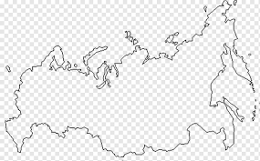 |

#### Изображение 2: Рентгеновский снимок

| Исходное | Полутоновое |
|:--------:|:-----------:|
| 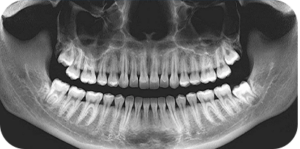 | 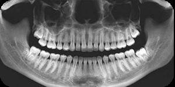 |

#### Изображение 3: Скриншот из мультфильма

| Исходное | Полутоновое |
|:--------:|:-----------:|
| 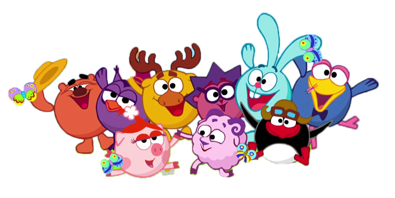 | 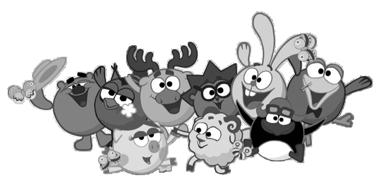 |

#### Изображение 4: Фотография

| Исходное | Полутоновое |
|:--------:|:-----------:|
|  |  |

#### Изображение 5: Отпечаток пальца

| Исходное | Полутоновое |
|:--------:|:-----------:|
|  | 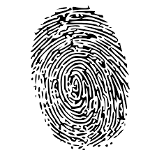 |

#### Изображение 6: Неравномерно засвеченная страница текста

| Исходное | Полутоновое |
|:--------:|:-----------:|
|  | 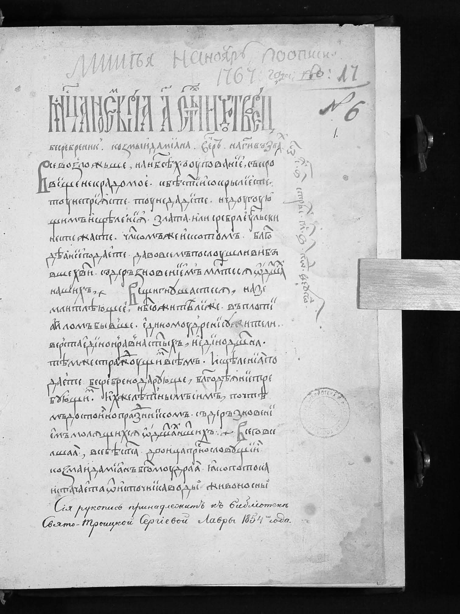 |

### 2. Результаты бинаризации (сравнение окон 3×3 и 25×25)

#### Изображение 1: Контурная карта

| WAN 3×3 | WAN 25×25 |
|:-------:|:---------:|
| 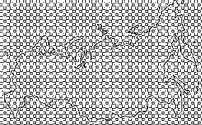 | 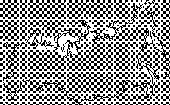 |

#### Изображение 2: Рентгеновский снимок

| WAN 3×3 | WAN 25×25 |
|:-------:|:---------:|
| 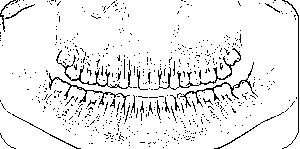 | 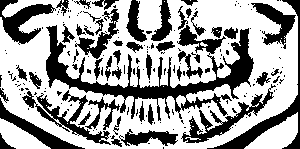 |

#### Изображение 3: Скриншот из мультфильма

| WAN 3×3 | WAN 25×25 |
|:-------:|:---------:|
| 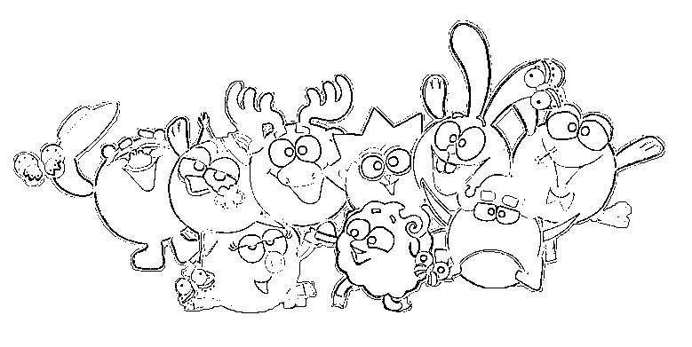 | 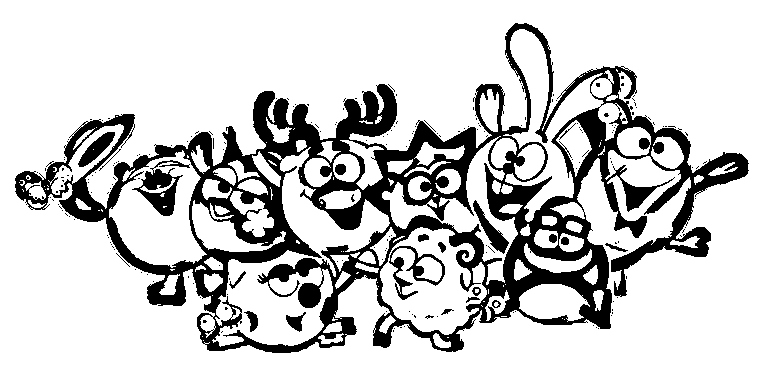 |

#### Изображение 4: Фотография

| WAN 3×3 | WAN 25×25 |
|:-------:|:---------:|
| 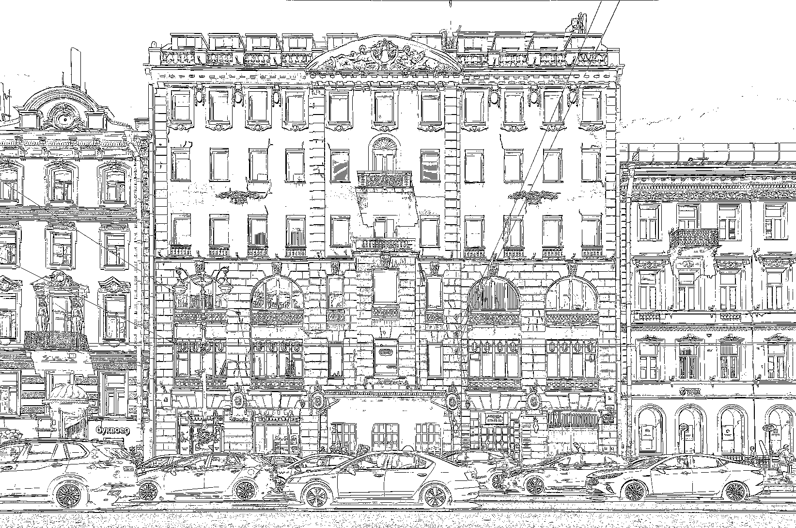 | 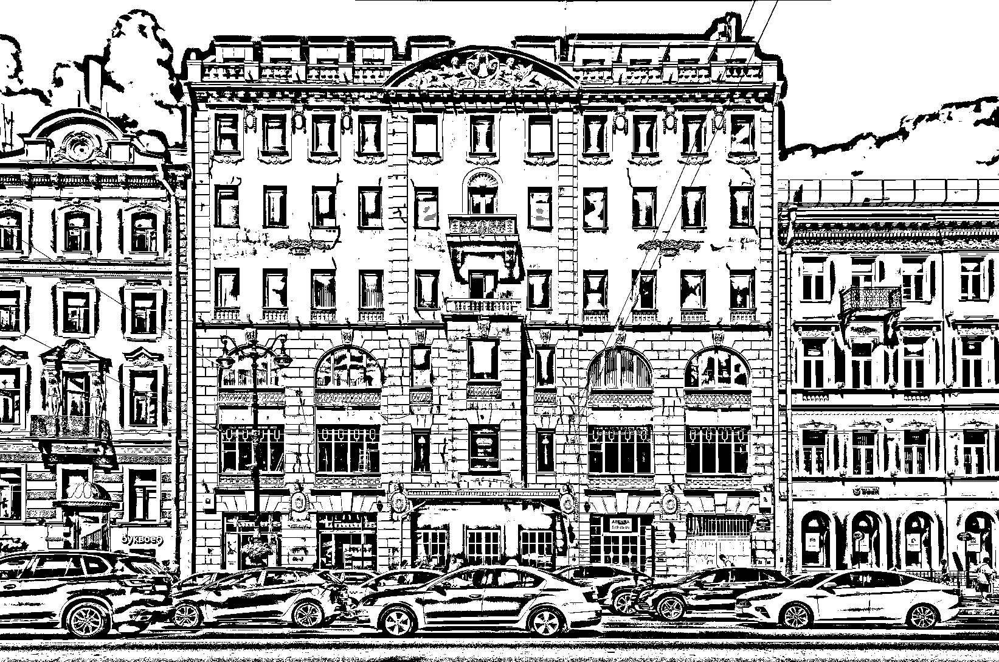 |

#### Изображение 5: Отпечаток пальца

| WAN 3×3 | WAN 25×25 |
|:-------:|:---------:|
| 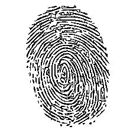 | 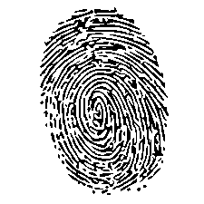 |

#### Изображение 6: Страница текста

| WAN 3×3 | WAN 25×25 |
|:-------:|:---------:|
| 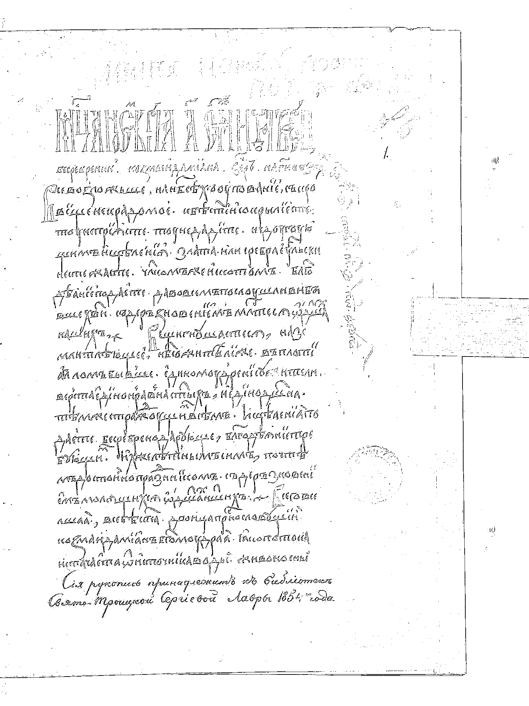 | 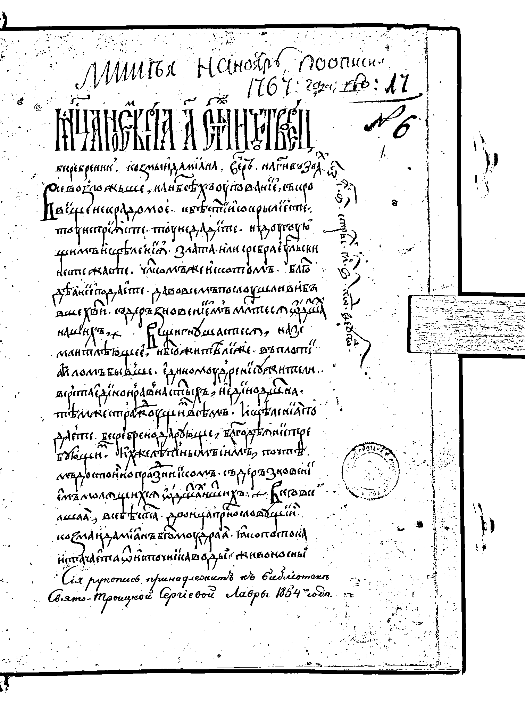 |

### 4. Заключение

В ходе выполнения лабораторной работы были реализованы:

1. **Преобразование RGB → полутон** с использованием взвешенного усреднения.
2. **Адаптивная бинаризация методом WAN** без применения библиотечных функций.
3. **Исследованы параметры метода**: размер окна (3×3 и 25×25).
4. **Обработаны 6 изображений** разных типов (контурная карта, рентгеновский снимок, скриншот из мультфильма, фотография, отпечаток пальца, страница текста).
