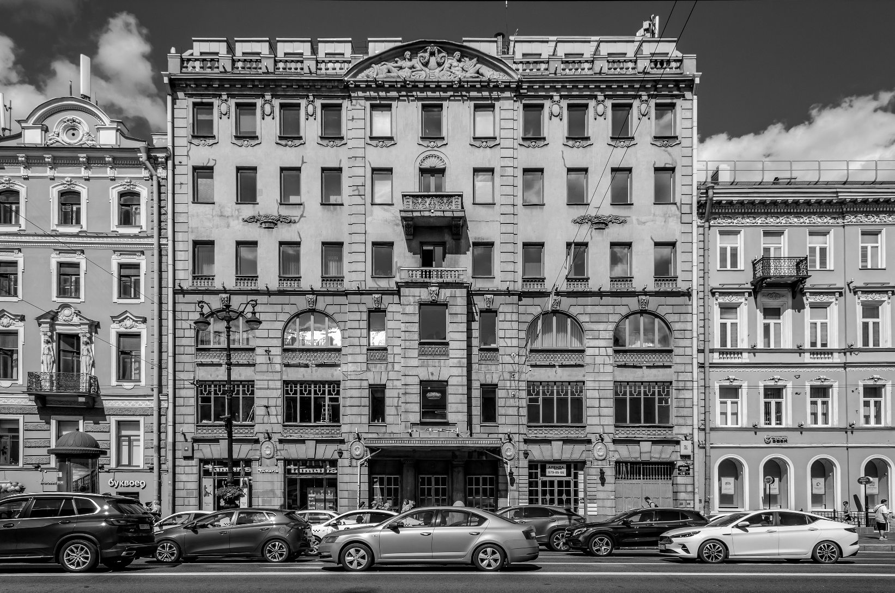
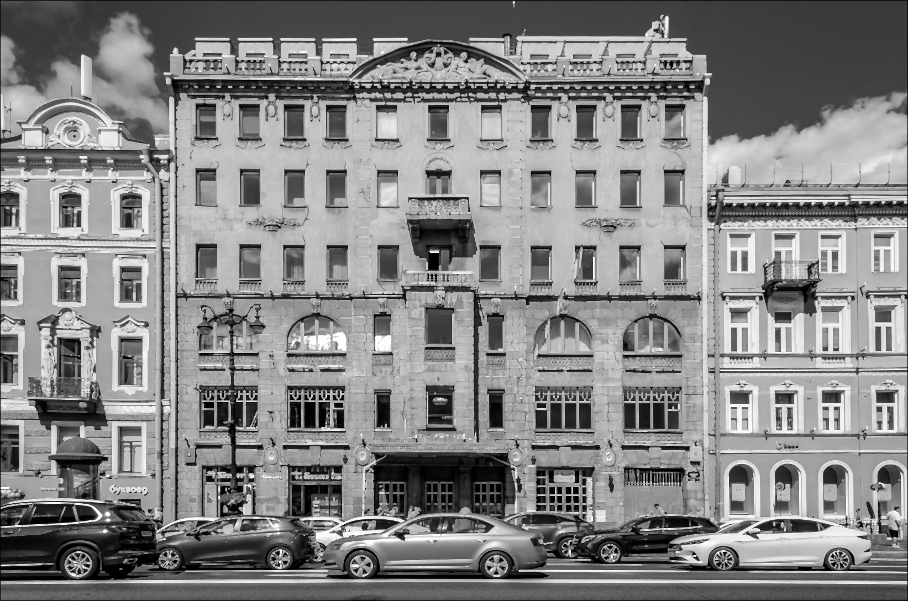
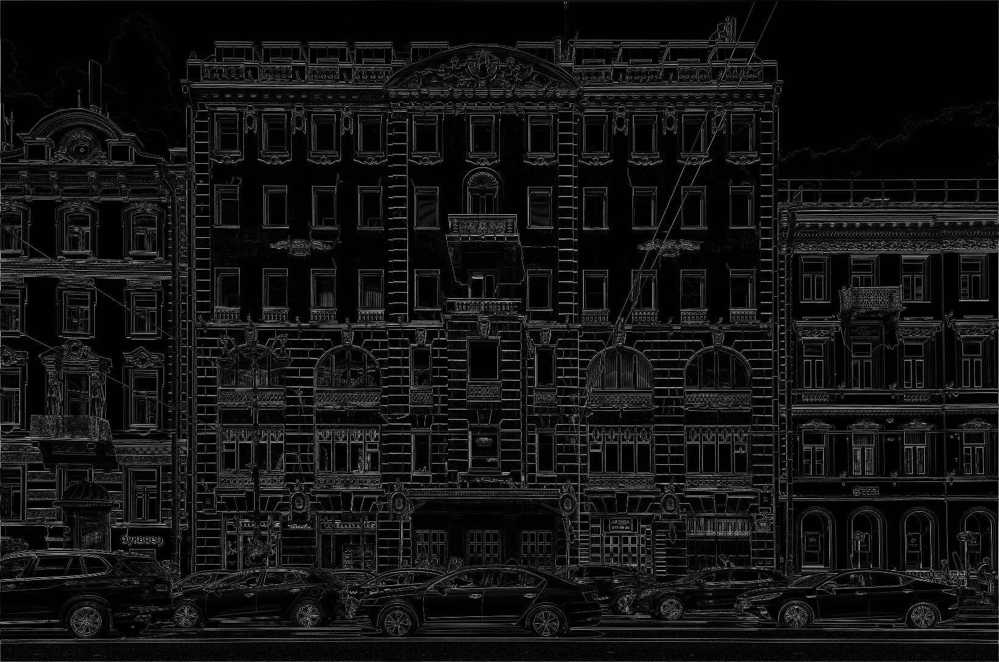
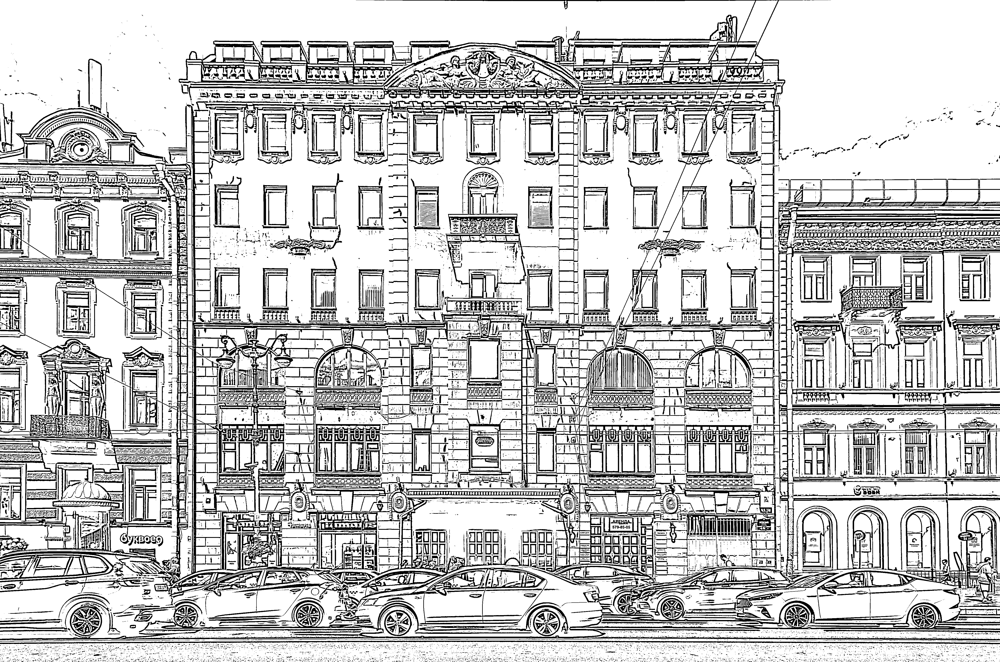
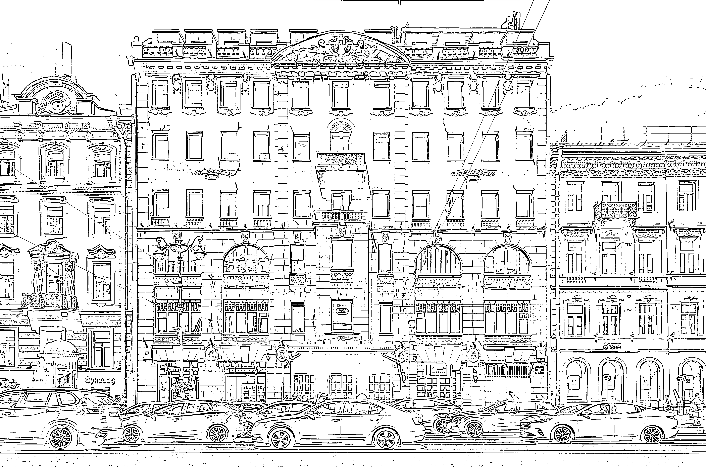
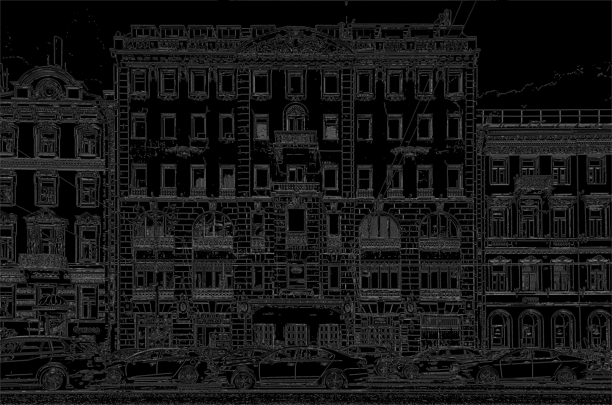

# Лабораторная работа №3

## Вариант 8: Ранговый фильтр с маской «равнина» 3×3

##### Полутоновое и монохромное изоображение были взяты из лабораторной работы 2

#### Ранговый фильтр (равнина 3×3) с рангом 7 / 9:

$$ \text{Mask} =
\begin{bmatrix}
1 & 1 & 1 \\
1 & 1 & 1 \\
1 & 1 & 1
\end{bmatrix} $$

Ранг 7/9 означает, что в каждом окне 3×3 (9 пикселей) значения сортируются по возрастанию и выбирается **7-й по счёту** элемент (индекс 6 при нумерации с 0).

#### Разностное изображение

Разностное изображение: **XOR** для монохрома 

**модуль разности** для полутона.

---

### 1. Исходные и полутоновые изображения

| Исходное (полноцветное) | Полутоновое |
|:-----------------------:|:-----------:|
|  |  |

---

### 2. Результаты фильтрации (полутоновое изображение)

| Полутоновое | После рангового фильтра (ранг 7/9) |
|:-----------:|:----------------------------------:|
|  |  |

#### Разностное изображение (полутон)

| Разность   |
|:-----------:|
 |

> *Примечание: raw-разность может быть тёмной, поэтому для наглядности применено контрастирование (умножение на 10).*

---

### 3. Результаты фильтрации (монохромное изображение)

В качестве монохромного (бинарного) изображения используется результат бинаризации методом WAN из Лабораторной №2.

| Монохромное (WAN) | После рангового фильтра (ранг 7/9) |
|:-----------------:|:----------------------------------:|
|  |  |

#### Разностное изображение (монохром, XOR)

| Разность (XOR) |
|:--------------:|
|  |

---
