# Лабораторная работа №4. Выделение контуров на изображении

## Вариант 8: Оператор Прюитт 3×3

#### Преобразование полноцветного изображения в полутоновое

Использовалось взвешенное усреднение каналов RGB:

$$Y = 0.299 \cdot R + 0.587 \cdot G + 0.114 \cdot B$$

#### Ядра оператора Прюитт 3×3

$$G_x = \begin{bmatrix}
1 & 0 & -1 \\
1 & 0 & -1 \\
1 & 0 & -1
\end{bmatrix} \quad
G_y = \begin{bmatrix}
1 & 1 & 1 \\
 0 &  0 &  0 \\
-1 & -1 & -1
\end{bmatrix}$$

#### Модуль градиента

$$G = |G_x| + |G_y|$$

---

### 1. Исходное и полутоновое изображения

| Исходное (RGB) | Полутоновое |
|:--------------:|:------------:|
| 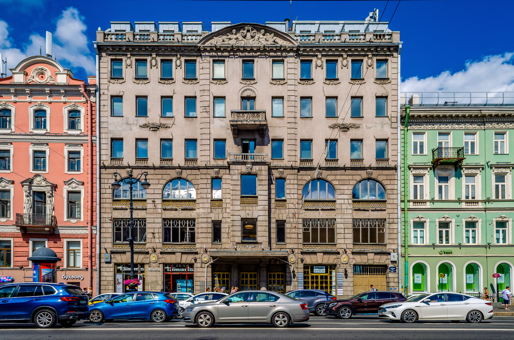 | 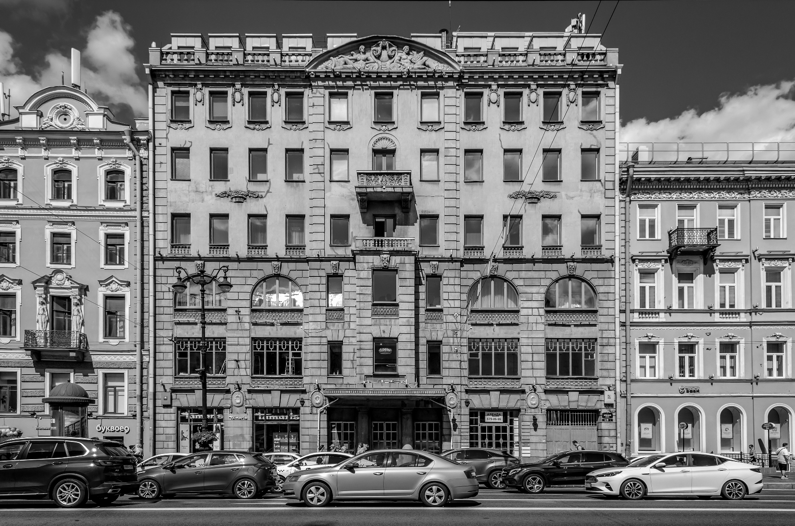 |

---

### 2. Градиентные матрицы \(G_x\), \(G_y\) и модуль градиента \(G\)

| \(G_x\) | \(G_y\) | \(G\) |
|:-------:|:-------:|:-----:|
| 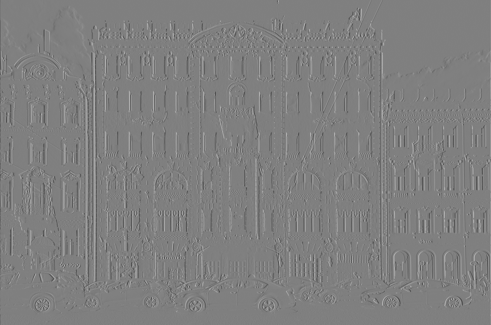 | 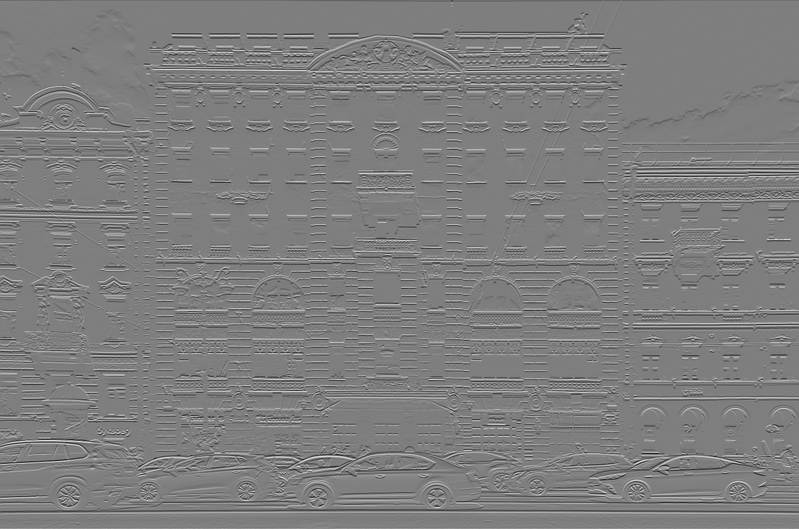 | 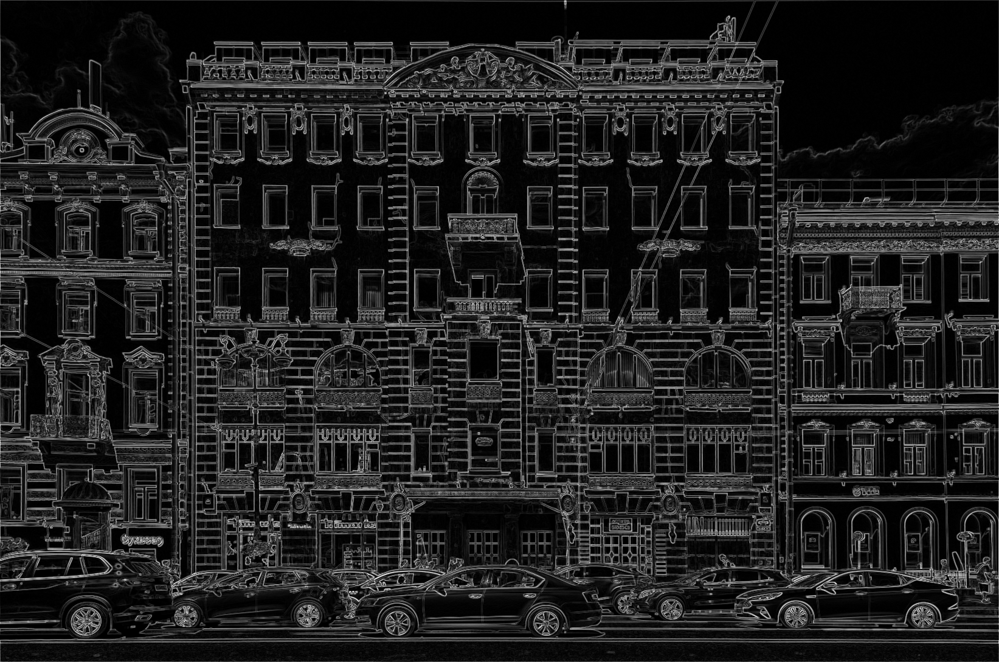 |

### 3. Сравнение порогов бинаризации

Для демонстрации влияния порога на результат можно получить бинарные изображения при различных значениях \(T\).  

| Порог | Результат бинаризации |
|:-----:|:----------------------:|
| **T=20** | 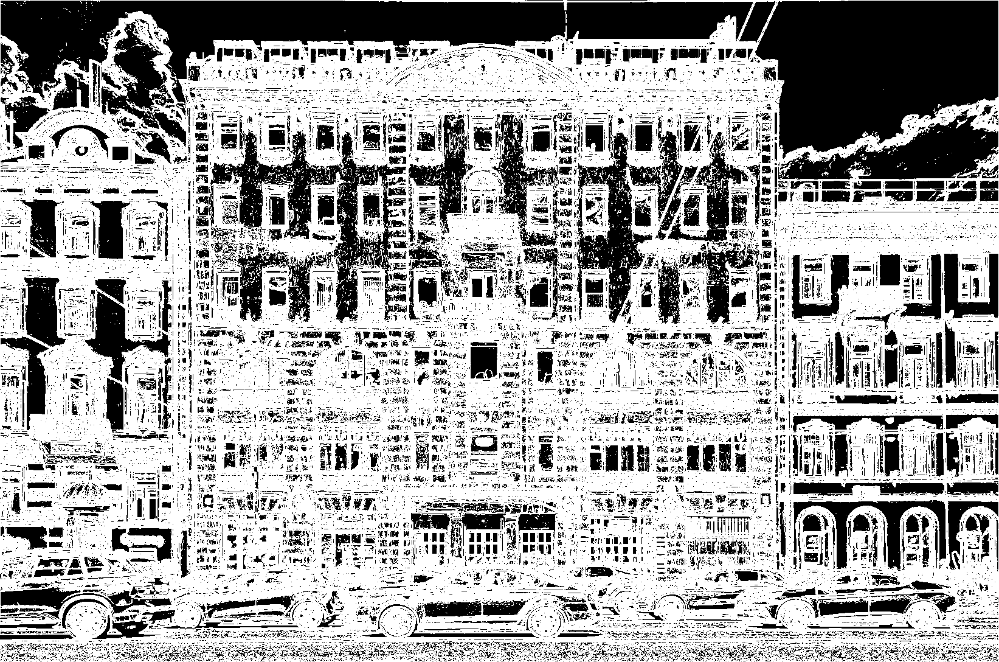 |
| **T=30** | |
| **T=40** | 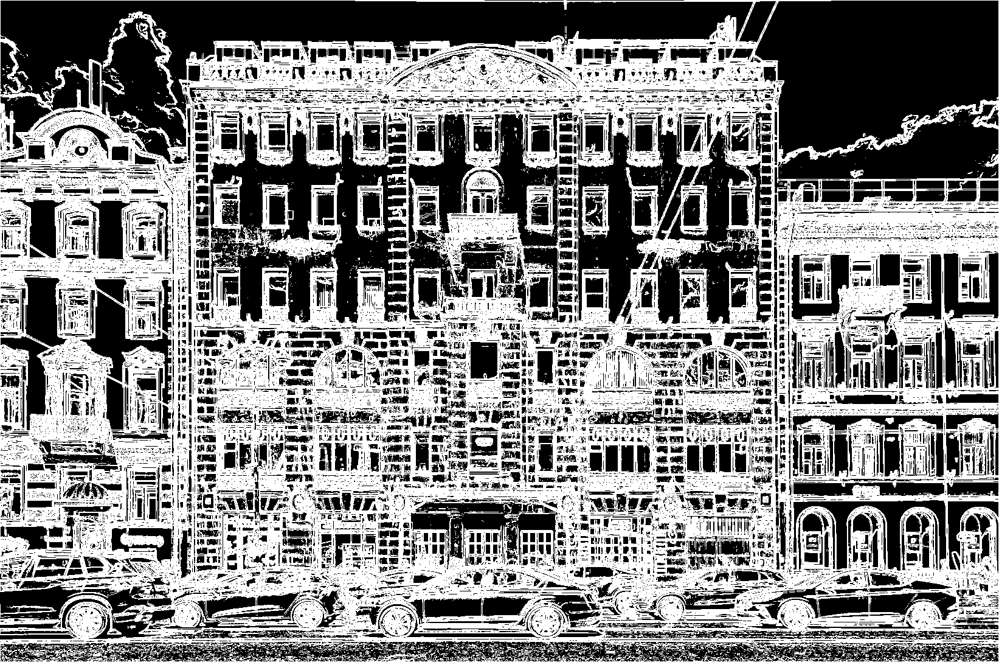 |
| **T=50** | 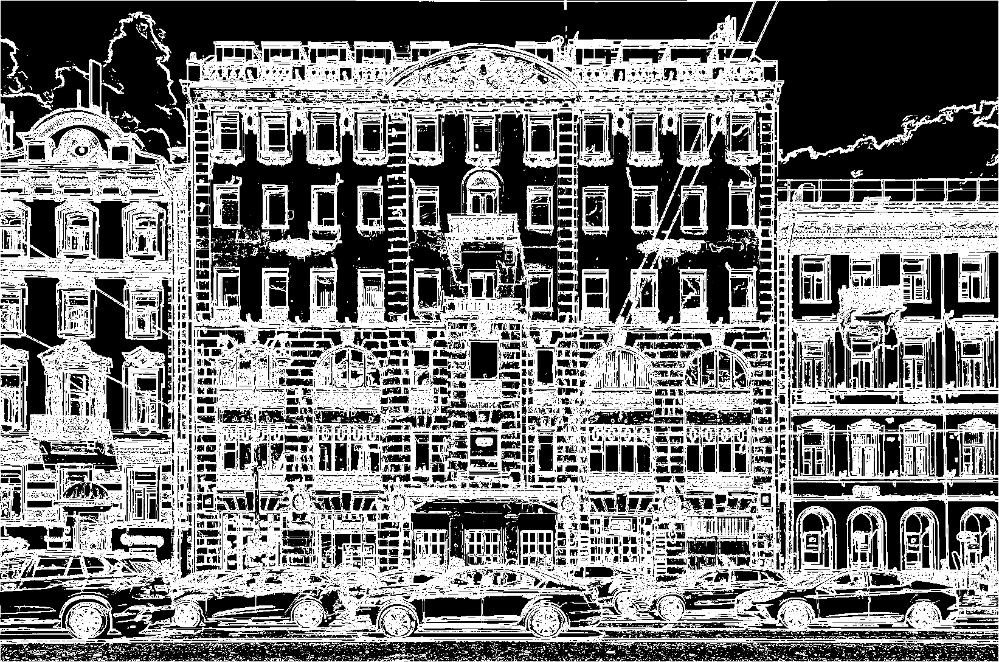 |
| **T=60** |  |
| **T=70** | 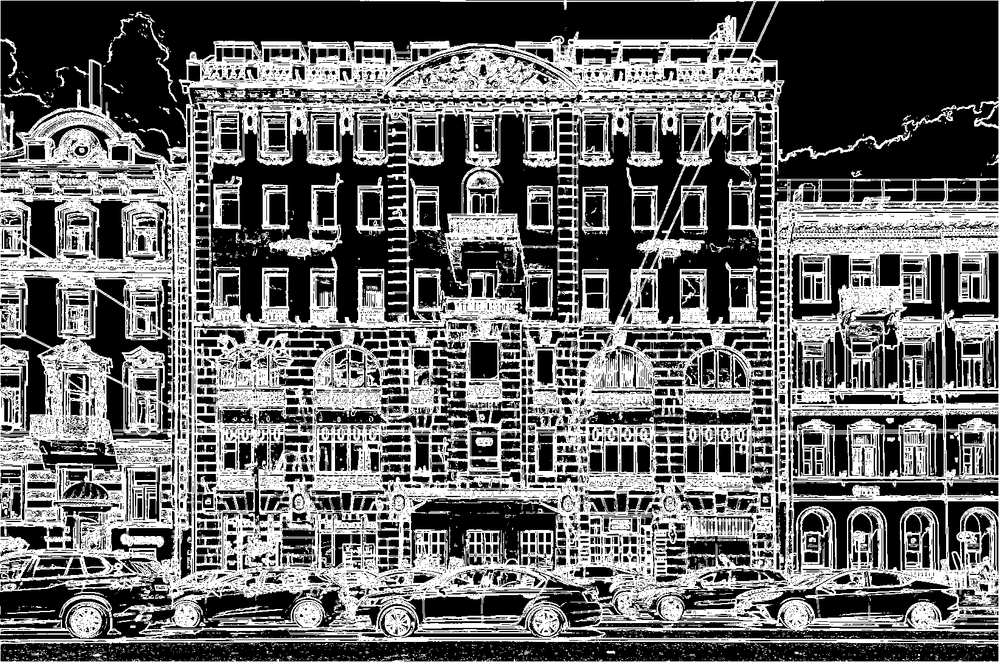 |
| **T=80** | 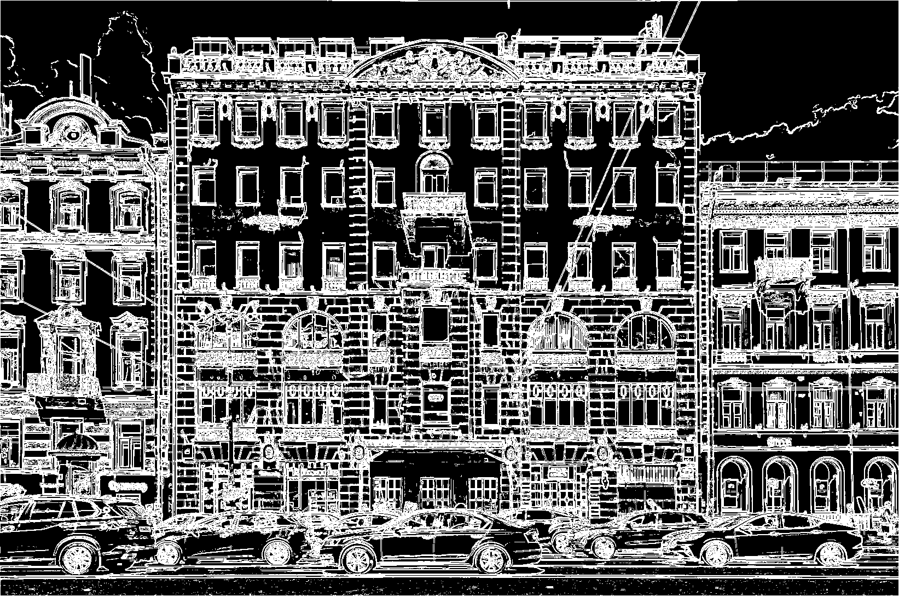 |
| **T=90** | 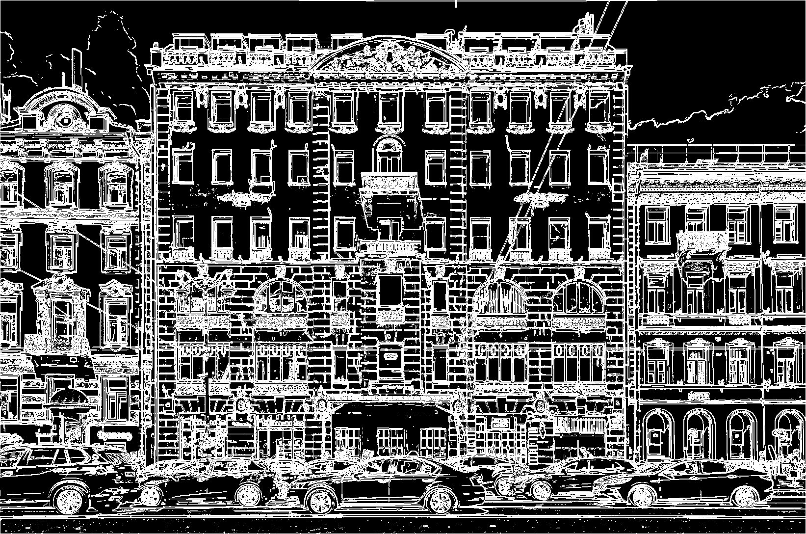 |
| **T=100** |  |

---
