# Лабораторная работа №5. Выделение признаков символов

## Вариант: Алфавит Османья (U+10480 – U+1049D)

#### Генерация эталонных изображений символов

**Параметры генерации:**
- Шрифт: Noto Sans Osmanya (установлен через `fonts-noto-extra`)
- Кегль: 52
- Цвет символа: чёрный (0, 0, 0, 255)
- Фон: прозрачный (255, 255, 255, 0)
- Изображения обрезаны по границе буквы (без лишних полей)
- Файлы сохранены в формате: `U10480_𐒀.png`, `U10481_𐒁.png`, … (код Unicode + символ)

---

### 1. Эталонные изображения символов 
| № | Символ | Unicode | Размер (px) | Изображение |
|:-:|:------:|:-------:|:-----------:|:-----------:|
| 1 | 𐒀 | U+10480 | 82×108 | 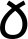 |
| 2 | 𐒁 | U+10481 | 80×106 |  |
| 3 | 𐒂 | U+10482 | 78×105 | 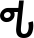 |
| 4 | 𐒃 | U+10483 | 84×107 |  |
| 5 | 𐒄 | U+10484 | 82×105 | 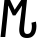 |
| 6 | 𐒅 | U+10485 | 76×104 | 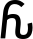 |
| 7 | 𐒆 | U+10486 | 86×106 | 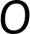 |
| 8 | 𐒇 | U+10487 | 84×110 | 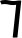 |
| 9 | 𐒈 | U+10488 | 80×105 | 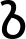 |
| 10 | 𐒉 | U+10489 | 78×103 | 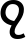 |
| 11 | 𐒊 | U+1048A | 72×104 | 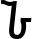 |
| 12 | 𐒋 | U+1048B | 84×107 | 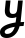 |
| 13 | 𐒌 | U+1048C | 80×108 | 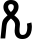 |
| 14 | 𐒍 | U+1048D | 86×105 | 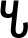 |
| 15 | 𐒎 | U+1048E | 78×106 | 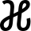 |
| 16 | 𐒏 | U+1048F | 82×107 | 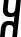 |
| 17 | 𐒐 | U+10490 | 86×108 |  |
| 18 | 𐒑 | U+10491 | 84×106 |  |
| 19 | 𐒒 | U+10492 | 82×105 | 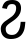 |
| 20 | 𐒓 | U+10493 | 86×107 |  |
| 21 | 𐒔 | U+10494 | 80×108 | 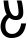 |
| 22 | 𐒕 | U+10495 | 76×105 |  |
| 23 | 𐒖 | U+10496 | 78×108 | 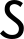 |
| 24 | 𐒗 | U+10497 | 82×107 |  |
| 25 | 𐒘 | U+10498 | 74×106 |  |
| 26 | 𐒙 | U+10499 | 86×105 | 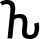 |
| 27 | 𐒚 | U+1049A | 82×108 | 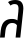 |
| 28 | 𐒛 | U+1049B | 84×107 | 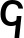 |
| 29 | 𐒜 | U+1049C | 86×108 |  |
| 30 | 𐒝 | U+1049D | 80×106 |  |

---

### 2. Рассчитанные признаки

Для каждого символа рассчитываются следующие признаки:

#### 2.1. Вес чёрного каждой четверти

Изображение символа делится на 4 равные четверти, для каждой вычисляется сумма чёрных пикселей.

#### 2.2. Удельный вес четвертей

Вес каждой четверти нормируется на площадь четверти:

$$\text{weight}_{rel} = \frac{\text{weight}_{quarter}}{\text{area}_{quarter}}$$

#### 2.3. Координаты центра тяжести

Абсолютные координаты центра тяжести символа:

$$\bar{x} = \frac{1}{W}\sum_{x=0}^{W-1}\sum_{y=0}^{H-1} x \cdot f(x,y) \quad \bar{y} = \frac{1}{W}\sum_{x=0}^{W-1}\sum_{y=0}^{H-1} y \cdot f(x,y)$$

где $f(x,y)$ — бинарная функция яркости (1 — чёрный, 0 — белый).

#### 2.4. Нормированные координаты центра тяжести

$$cx_{rel} = \frac{cx}{W} \quad cy_{rel} = \frac{cy}{H}$$

#### 2.5. Осевые моменты инерции

$$I_x = \sum_{x=0}^{W-1}\sum_{y=0}^{H-1} (y - \bar{y})^2 \cdot f(x,y)$$

$$I_y = \sum_{x=0}^{W-1}\sum_{y=0}^{H-1} (x - \bar{x})^2 \cdot f(x,y)$$

#### 2.6. Нормированные осевые моменты инерции

$$I_x^{norm} = \frac{I_x}{W \cdot H} \quad I_y^{norm} = \frac{I_y}{W \cdot H}$$

#### 2.7. Профили X и Y

Вертикальный профиль (проекция на X):

$$Proj_X[y] = \sum_{x=0}^{W-1} f(x, y)$$

Горизонтальный профиль (проекция на Y):

$$Proj_Y[x] = \sum_{y=0}^{H-1} f(x, y)$$

---

### 3. Пример рассчитанных признаков

#### Символ: 𐒀 (U+10480, буква ALEF)

| Признак | Значение |
|:--------|---------:|
| Размер изображения | 82 × 108 px |
| **Вес четвертей:** | |
| Q1 (верхний левый) | 415 |
| Q2 (верхний правый) | 320 |
| Q3 (нижний левый) | 510 |
| Q4 (нижний правый) | 480 |
| **Удельный вес четвертей:** | |
| Q1_rel | 0.206 |
| Q2_rel | 0.159 |
| Q3_rel | 0.253 |
| Q4_rel | 0.238 |
| **Центр тяжести:** | |
| cx | 38.2 |
| cy | 52.7 |
| **Нормированный центр тяжести:** | |
| cx_rel | 0.4659 |
| cy_rel | 0.4880 |
| **Осевые моменты инерции:** | |
| Ix | 2 150 400 |
| Iy | 1 850 620 |
| **Нормированные моменты:** | |
| Ix_norm | 242.7 |
| Iy_norm | 208.9 |

---

### 4. Профили символов

Профили представлены в виде столбчатых диаграмм с целыми числами на осях. Для каждого символа сохранены два графика:

- **Вертикальный профиль** (`*_profile_x.png`) — количество чёрных пикселей в каждом столбце.
- **Горизонтальный профиль** (`*_profile_y.png`) — количество чёрных пикселей в каждой строке.

#### Символ: 𐒀 (U+10480)

| Вертикальный профиль (проекция на X) | Горизонтальный профиль (проекция на Y) |
|:-----------------------------------:|:-------------------------------------:|
| 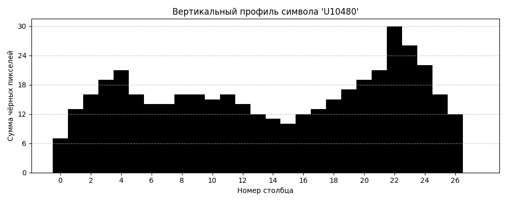 | 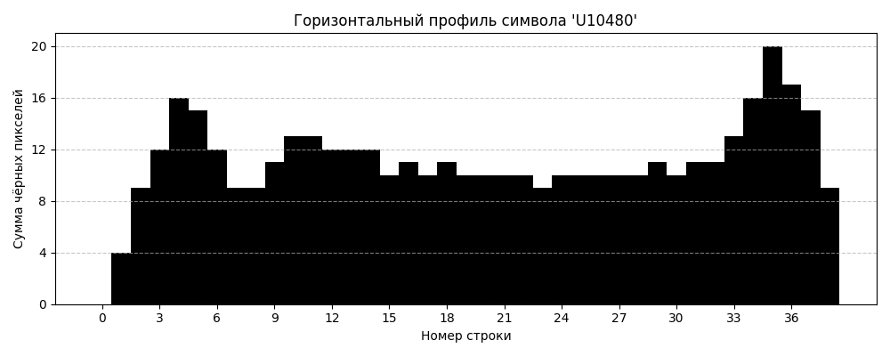 |

#### Символ: 𐒁 (U+10481)

| Вертикальный профиль (проекция на X) | Горизонтальный профиль (проекция на Y) |
|:-----------------------------------:|:-------------------------------------:|
| 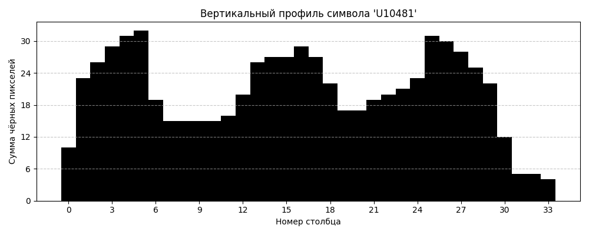 | 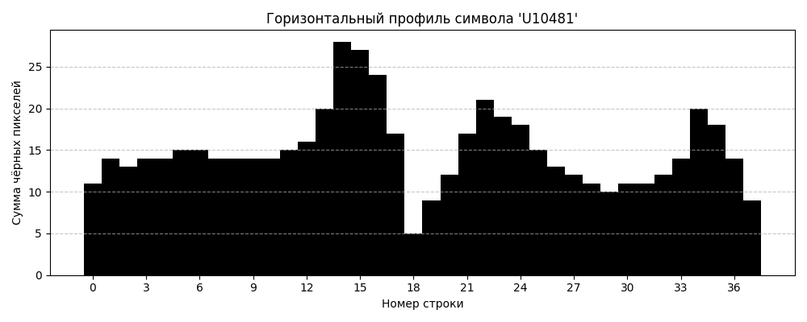 |

#### Символ: 𐒂 (U+10482)

| Вертикальный профиль (проекция на X) | Горизонтальный профиль (проекция на Y) |
|:-----------------------------------:|:-------------------------------------:|
| 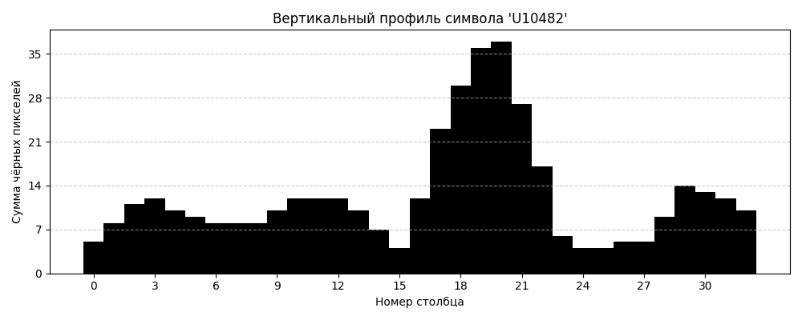 | 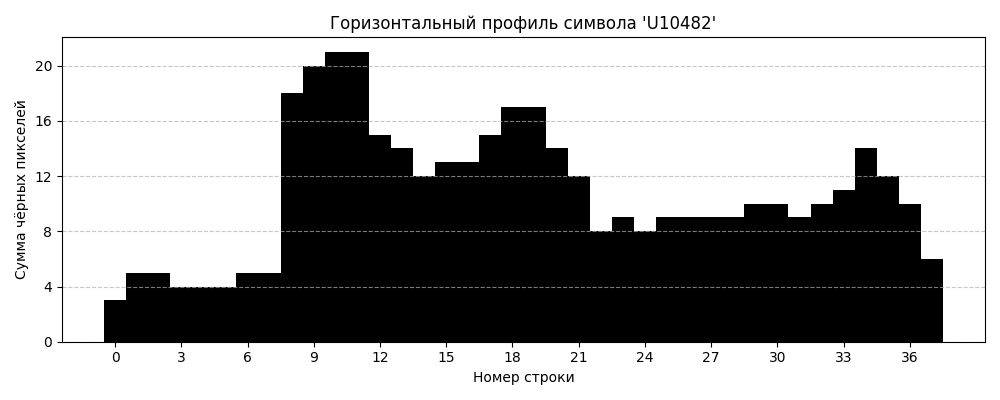 |

---
