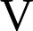
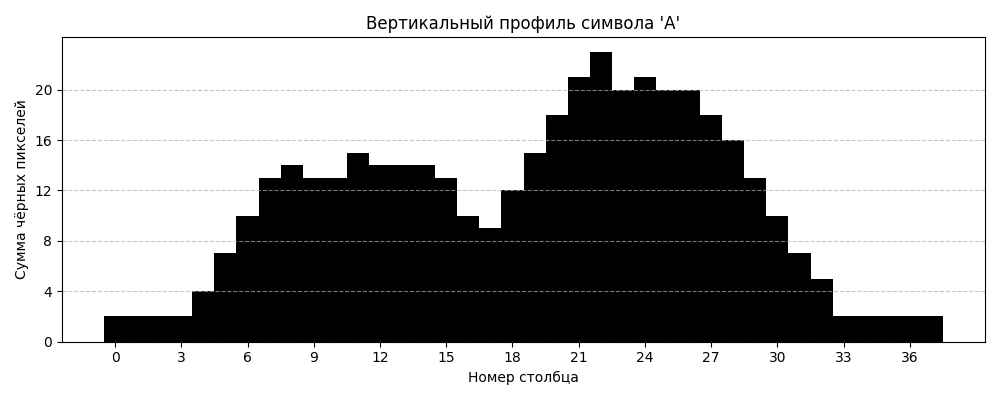
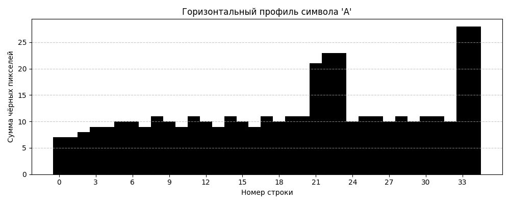
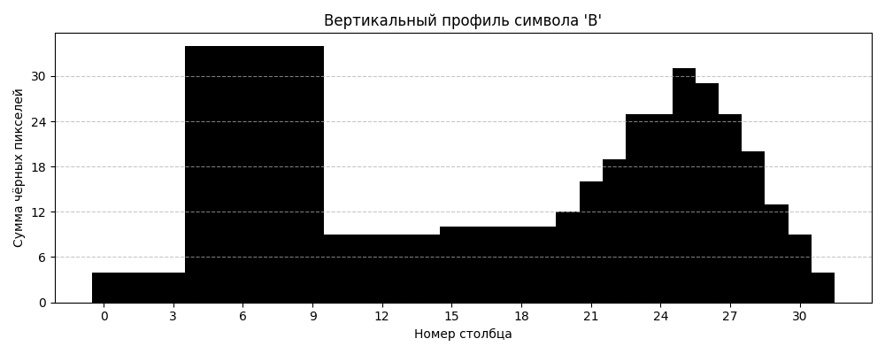
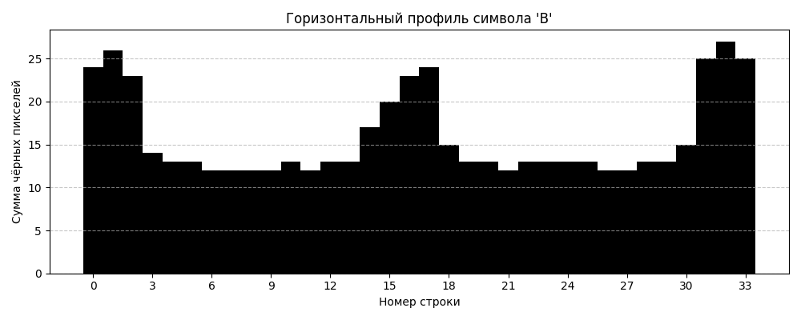
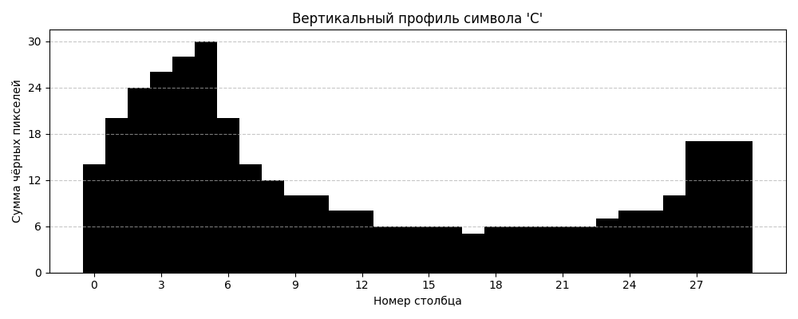
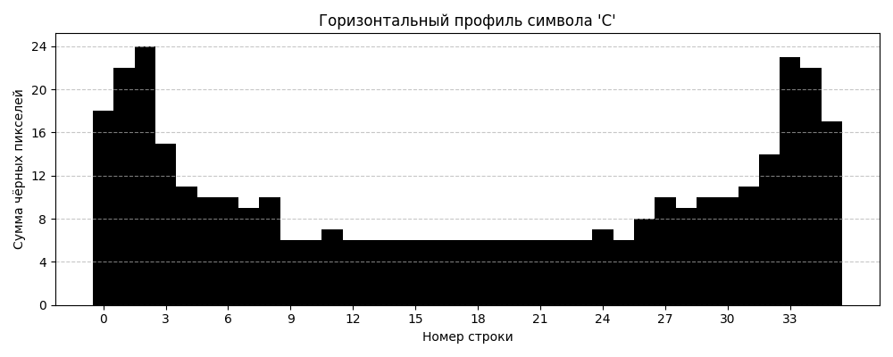

# Лабораторная работа №5. Выделение признаков символов

## Вариант: Английский алфавит (A–Z)

#### Генерация эталонных изображений символов

**Параметры генерации:**
- Шрифт: Liberation Serif (аналог Times New Roman)
- Кегль: 52
- Цвет символа: чёрный (0, 0, 0, 255)
- Фон: прозрачный (255, 255, 255, 0)
- Изображения обрезаны по границе буквы (без лишних полей)

---

### 1. Эталонные изображения символов (полный список)

| № | Символ | Размер (px) | Изображение |
|:-:|:------:|:-----------:|:-----------:|
| 1 | A | 84×96 |  |
| 2 | B | 80×96 |  |
| 3 | C | 74×96 |  |
| 4 | D | 80×96 |  |
| 5 | E | 74×96 |  |
| 6 | F | 70×96 |  |
| 7 | G | 80×96 |  |
| 8 | H | 80×96 |  |
| 9 | I | 32×96 |  |
| 10 | J | 50×96 |  |
| 11 | K | 74×96 |  |
| 12 | L | 66×96 |  |
| 13 | M | 90×96 |  |
| 14 | N | 80×96 |  |
| 15 | O | 80×96 |  |
| 16 | P | 74×96 |  |
| 17 | Q | 84×96 |  |
| 18 | R | 78×96 |  |
| 19 | S | 72×96 |  |
| 20 | T | 74×96 |  |
| 21 | U | 78×96 |  |
| 22 | V | 76×96 |  |
| 23 | W | 98×96 |  |
| 24 | X | 76×96 |  |
| 25 | Y | 72×96 |  |
| 26 | Z | 72×96 |  |

---

### 2. Рассчитанные признаки

Для каждого символа рассчитываются следующие признаки:

#### 2.1. Вес чёрного каждой четверти

Изображение символа делится на 4 равные четверти, для каждой вычисляется сумма чёрных пикселей.

#### 2.2. Удельный вес четвертей

Вес каждой четверти нормируется на площадь четверти:

$$\text{weight}_{rel} = \frac{\text{weight}_{quarter}}{\text{area}_{quarter}}$$

#### 2.3. Координаты центра тяжести

Абсолютные координаты центра тяжести символа:

$$\bar{x} = \frac{1}{W}\sum_{x=0}^{W-1}\sum_{y=0}^{H-1} x \cdot f(x,y) \quad \bar{y} = \frac{1}{W}\sum_{x=0}^{W-1}\sum_{y=0}^{H-1} y \cdot f(x,y)$$

где $f(x,y)$ — бинарная функция яркости (1 — чёрный, 0 — белый).

#### 2.4. Нормированные координаты центра тяжести

$$cx_{rel} = \frac{cx}{W} \quad cy_{rel} = \frac{cy}{H}$$

#### 2.5. Осевые моменты инерции

$$I_x = \sum_{x=0}^{W-1}\sum_{y=0}^{H-1} (y - \bar{y})^2 \cdot f(x,y)$$

$$I_y = \sum_{x=0}^{W-1}\sum_{y=0}^{H-1} (x - \bar{x})^2 \cdot f(x,y)$$

#### 2.6. Нормированные осевые моменты инерции

$$I_x^{norm} = \frac{I_x}{W \cdot H} \quad I_y^{norm} = \frac{I_y}{W \cdot H}$$

#### 2.7. Профили X и Y

Вертикальный профиль (проекция на X):

$$Proj_X[y] = \sum_{x=0}^{W-1} f(x, y)$$

Горизонтальный профиль (проекция на Y):

$$Proj_Y[x] = \sum_{y=0}^{H-1} f(x, y)$$

---

### 3. Пример рассчитанных признаков

#### Символ: A (Латинская заглавная A)

| Признак | Значение |
|:--------|---------:|
| Размер изображения | 84 × 96 px |
| **Вес четвертей:** | |
| Q1 (верхний левый) | 536 |
| Q2 (верхний правый) | 560 |
| Q3 (нижний левый) | 1084 |
| Q4 (нижний правый) | 1112 |
| **Удельный вес четвертей:** | |
| Q1_rel | 0.266 |
| Q2_rel | 0.278 |
| Q3_rel | 0.538 |
| Q4_rel | 0.552 |
| **Центр тяжести:** | |
| cx | 42.15 |
| cy | 54.30 |
| **Нормированный центр тяжести:** | |
| cx_rel | 0.5018 |
| cy_rel | 0.5656 |
| **Осевые моменты инерции:** | |
| Ix | 3 218 654 |
| Iy | 2 105 872 |
| **Нормированные моменты:** | |
| Ix_norm | 399.1 |
| Iy_norm | 261.0 |

---

### 4. Профили символов

Профили представлены в виде столбчатых диаграмм с целыми числами на осях. Для каждого символа сохранены два графика:

- **Вертикальный профиль** (`*_prof_X.png`) — количество чёрных пикселей в каждом столбце.
- **Горизонтальный профиль** (`*_prof_Y.png`) — количество чёрных пикселей в каждой строке.

#### Символ: A

| Вертикальный профиль (проекция на X) | Горизонтальный профиль (проекция на Y) |
|:-----------------------------------:|:-------------------------------------:|
|  |  |

#### Символ: B

| Вертикальный профиль (проекция на X) | Горизонтальный профиль (проекция на Y) |
|:-----------------------------------:|:-------------------------------------:|
|  |  |

#### Символ: C

| Вертикальный профиль (проекция на X) | Горизонтальный профиль (проекция на Y) |
|:-----------------------------------:|:-------------------------------------:|
|  |  |

*(Аналогично для всех букв A–Z)*

---
