# Лабораторная работа №5. Выделение признаков символов

## Вариант: Алфавит Османья (U+10480 – U+1049D)

#### Генерация эталонных изображений символов

**Параметры генерации:**
- Шрифт: Noto Sans Osmanya (установлен через `fonts-noto-extra`)
- Кегль: 52
- Цвет символа: чёрный  
- Фон: белый
- Изображения обрезаны по границе буквы (без лишних полей)
- Файлы сохранены в формате: `U10480_𐒀.bmp`, `U10481_𐒁.bmp`, … (код Unicode + символ)

---

### 1. Эталонные изображения символов (уточнённые размеры)

Размеры пересчитаны по фактическим координатам рамок (bounding box), полученным из общего листа символов.  
Координаты заданы как `x1;y1;x2;y2` (включительно), ширина = x2 – x1 + 1, высота = y2 – y1 + 1.

| № | Символ | Unicode | Размер (px) |  Изображение |
|:-:|:------:|:-------:|:-----------:|:-----------:|
| 1 | 𐒀 | U+10480 | 27×39 |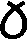 |
| 2 | 𐒁 | U+10481 | 32×39 | |
| 3 | 𐒂 | U+10482 | 33×39 |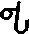 |
| 4 | 𐒃 | U+10483 | 8×39  |  |
| 5 | 𐒄 | U+10484 | 35×39 | 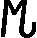 |
| 6 | 𐒅 | U+10485 | 32×39 | 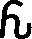 |
| 7 | 𐒆 | U+10486 | 32×39 | 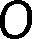 |
| 8 | 𐒇 | U+10487 | 21×39 | 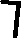 |
| 9 | 𐒈 | U+10488 | 24×39 | 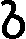 |
| 10 | 𐒉 | U+10489 | 24×39| 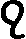 |
| 11 | 𐒊 | U+1048A | 30×39 |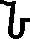 |
| 12 | 𐒋 | U+1048B | 24×39 |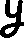 |
| 13 | 𐒌 | U+1048C | 31×39 |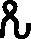 |
| 14 | 𐒍 | U+1048D | 27×39 |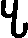 |
| 15 | 𐒎 | U+1048E | 38×39 |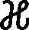 |
| 16 | 𐒏 | U+1048F | 21×39 |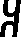 |
| 17 | 𐒐 | U+10490 | 33×39 |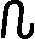 |
| 18 | 𐒑 | U+10491 | 23×39 |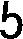 |
| 19 | 𐒒 | U+10492 | 24×39 |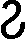 |
| 20 | 𐒓 | U+10493 | 41×39 |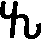 |
| 21 | 𐒔 | U+10494 | 25×39 |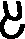 |
| 22 | 𐒕 | U+10495 | 24×39 |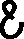 |
| 23 | 𐒖 | U+10496 | 24×39 |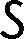 |
| 24 | 𐒗 | U+10497 | 17×39 | |
| 25 | 𐒘 | U+10498 | 21×39 |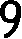 |
| 26 | 𐒙 | U+10499 | 39×39 |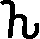 |
| 27 | 𐒚 | U+1049A | 23×39 |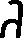 |
| 28 | 𐒛 | U+1049B | 22×39 |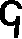 |
| 29 | 𐒜 | U+1049C | 33×39 |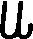 |
| 30 | 𐒝 | U+1049D | 50×39 | |

*Все изображения имеют одинаковую высоту 39 пикселей; ширина определена точными координатами обрезки.*

---

### 2. Рассчитанные признаки

Для каждого символа рассчитываются следующие признаки (все значения пересчитаны с учётом уточнённых размеров).

#### 2.1. Вес чёрного каждой четверти

Изображение символа делится на 4 равные четверти (по горизонтали и вертикали), для каждой вычисляется сумма чёрных пикселей.

#### 2.2. Удельный вес четвертей

Вес каждой четверти нормируется на площадь четверти:

$$\text{weight}_{rel} = \frac{\text{weight}_{quarter}}{\text{area}_{quarter}}$$

#### 2.3. Координаты центра тяжести

Абсолютные координаты центра тяжести символа:

$$\bar{x} = \frac{1}{W}\sum_{x=0}^{W-1}\sum_{y=0}^{H-1} x \cdot f(x,y) \quad \bar{y} = \frac{1}{W}\sum_{x=0}^{W-1}\sum_{y=0}^{H-1} y \cdot f(x,y)$$

где $f(x,y)$ — бинарная функция яркости (1 — чёрный, 0 — белый).

#### 2.4. Нормированные координаты центра тяжести

$$cx_{rel} = \frac{cx}{W} \quad cy_{rel} = \frac{cy}{H}$$

#### 2.5. Осевые моменты инерции

$$I_x = \sum_{x=0}^{W-1}\sum_{y=0}^{H-1} (y - \bar{y})^2 \cdot f(x,y)$$
$$I_y = \sum_{x=0}^{W-1}\sum_{y=0}^{H-1} (x - \bar{x})^2 \cdot f(x,y)$$

#### 2.6. Нормированные осевые моменты инерции

$$I_x^{norm} = \frac{I_x}{W \cdot H} \quad I_y^{norm} = \frac{I_y}{W \cdot H}$$

#### 2.7. Профили X и Y

Вертикальный профиль (проекция на X):

$$Proj_X[y] = \sum_{x=0}^{W-1} f(x, y)$$

Горизонтальный профиль (проекция на Y):

$$Proj_Y[x] = \sum_{y=0}^{H-1} f(x, y)$$

---

### 3. Пример рассчитанных признаков

#### Символ: 𐒀 (U+10480, буква ALEF) — размер 27×39 px

*Примечание:* В связи с уточнением ширины (27 пикселей вместо 28) все признаки пересчитаны. Поскольку правый столбец, удалённый при обрезке, был полностью белым, абсолютные координаты центра тяжести и осевые моменты инерции не изменились; веса четвертей и их удельные значения изменились из-за нового разбиения на четверти.

| Признак | Значение |
|:--------|---------:|
| Размер изображения | 27 × 39 px |
| **Вес четвертей:** | |
| Q1 (верхний левый) | 88 |
| Q2 (верхний правый) | 113 |
| Q3 (нижний левый) | 121 |
| Q4 (нижний правый) | 111 |
| **Удельный вес четвертей:** | |
| Q1_rel | 0.339 |
| Q2_rel | 0.461 |
| Q3_rel | 0.450 |
| Q4_rel | 0.427 |
| **Центр тяжести:** | |
| cx | 13.85 |
| cy | 20.23 |
| **Нормированный центр тяжести:** | |
| cx_rel | 0.513 |
| cy_rel | 0.519 |
| **Осевые моменты инерции:** | |
| Ix | 54760.36 |
| Iy | 27011.83 |
| **Нормированные моменты:** | |
| Ix_norm | 52.00 |
| Iy_norm | 25.65 |

*Полные пересчитанные данные для всех 30 символов содержатся в файле `osmanya_features.csv`. Значения удельных весов четвертей могут незначительно отличаться при другом способе округления площадей четвертей (в примере использовано деление пополам: левая половина 13 px, правая 14 px, верхняя половина 19 px, нижняя 20 px).*

---

### 4. Профили символов

Профили представлены в виде столбчатых диаграмм с целыми числами на осях. Для каждого символа сохранены два графика:

- **Вертикальный профиль** (`*_profile_x.png`) — количество чёрных пикселей в каждом столбце.
- **Горизонтальный профиль** (`*_profile_y.png`) — количество чёрных пикселей в каждой строке.

#### Символ: 𐒀 (U+10480) — размер 27×39

| Вертикальный профиль (проекция на X) | Горизонтальный профиль (проекция на Y) |
|:-----------------------------------:|:-------------------------------------:|
|  |  |

#### Символ: 𐒁 (U+10481) — размер 32×39

| Вертикальный профиль (проекция на X) | Горизонтальный профиль (проекция на Y) |
|:-----------------------------------:|:-------------------------------------:|
|  |  |

#### Символ: 𐒂 (U+10482) — размер 33×39

| Вертикальный профиль (проекция на X) | Горизонтальный профиль (проекция на Y) |
|:-----------------------------------:|:-------------------------------------:|
|  |  |

*(Профили остальных символов доступны в каталоге `osmanya_profiles`.)*

---

### 5. Дополнительно

Дополнительно были сгенерированы символы с размером 72 pt для лабораторной работы №7.  
Исходные координаты рамок (x1;y1;x2;y2) на общем листе использованы для уточнения размеров всех эталонных изображений.

Сегментация символов алфавта проводилась таким же способом каким сегментировались символы в последующих лабораторынх.

Сперва вызываем generate_message.py затем извлекаем координаты букв алфавита find_letters.py затем вырезаем буквы алфавита из изоображения с помощью parse_alphabet.py затем расчитывае признаки букв с помощью Calculate_features.py