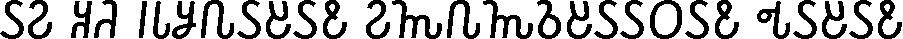
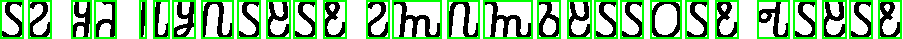
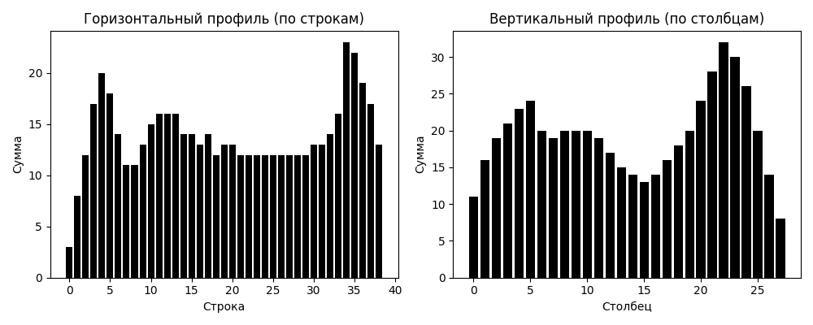
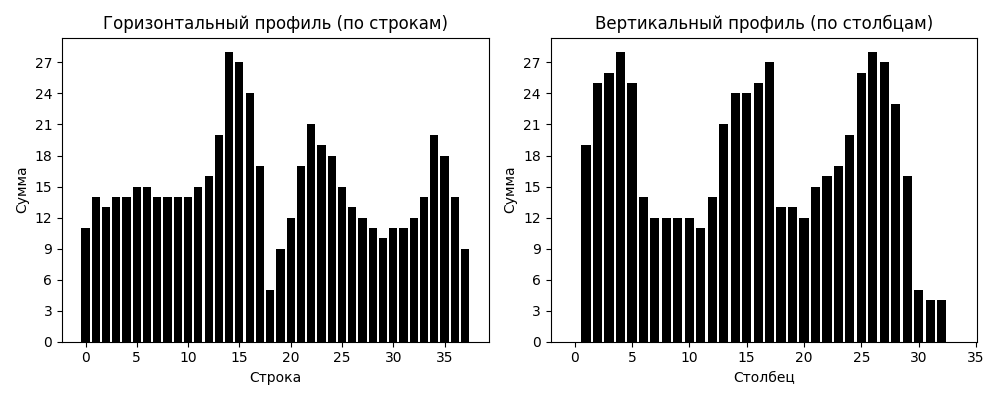
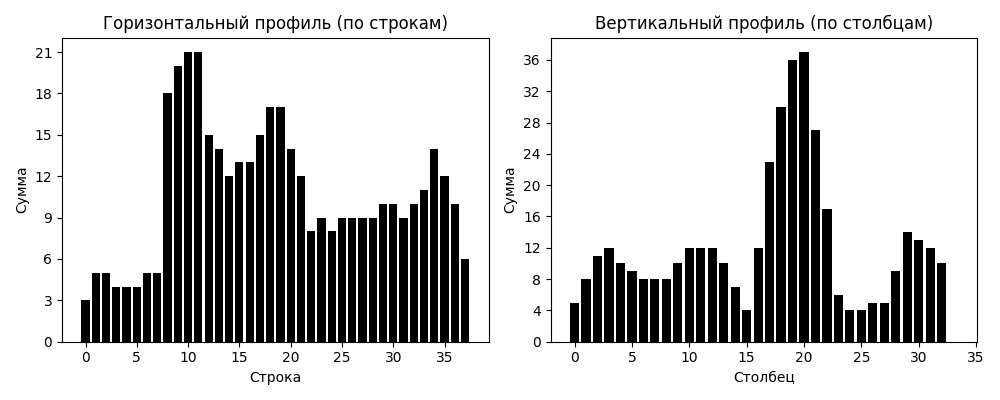

# Лабораторная работа №6. Сегментация текста

## Вариант: 8, Алфавит Османья (U+10480 – U+1049D)

### 1. Подготовка тестового изображения

В Libre Office была набрана романтическая фраза на алфавите Османья (шрифт Noto Sans Osmanya, кегль 52). Фраза состоит из одной строки:

**𐒖𐒒 𐒏𐒚 𐒃𐒗𐒋𐒐𐒖𐒔𐒖𐒕 𐒒𐒝𐒐𐒝𐒈𐒔𐒖𐒖𐒆𐒖𐒕 𐒂𐒖𐒔𐒖𐒕**

*(Транскрипция: An ku jeclahay. Noloshaaday tahay. — «Я тебя люблю. Ты — моя жизнь.»)*

Скриншот был обработан с помощью Python (Pillow) для получения монохромного изображения(`to_parse.bmp`). Буквы чёрные.

| Исходное изображение |
|:--------------------:|
|  |

---

### 2. Алгоритм расчёта горизонтального и вертикального профиля изображения

Для бинарного изображения (чёрный = 1, белый/прозрачный = 0) профили вычисляются как суммы пикселей по осям:

- **Горизонтальный профиль:** сумма по строкам ($H(y) = \sum_{x} f(x,y)$) — показывает, где находятся строки текста.
- **Вертикальный профиль:** сумма по столбцам ($V(x) = \sum_{y} f(x,y)$) — показывает, где находятся буквы внутри строки.

### 3. Сегментация символов на основе профилей с прореживанием

Для тестового изображения была выполнена сегментация строк и символов.

**Результаты:**
- По горизонтальному профилю выделена 1 строка (для 52 pt) текста.
- Для каждой строки по вертикальному профилю найдены границы отдельных символов.
- Полученные координаты ограничивающих прямоугольников упорядочены в порядке чтения (сверху вниз, слева направо).

Координаты сохранены в файле `segmentation_coords.csv`.

**Визуализация результата:** на исходном прозрачном изображении зелёными прямоугольниками обведены найденные символы.

| Результат сегментации |
|:---------------------:|
|  |

---

### 4. Построение профилей символов выбранного алфавита

Для всех 30 символов алфавита Османья (из папки `osmanya_chars/`) построены эталонные **горизонтальные и вертикальные профили**.

Профили представляют собой столбчатые диаграммы распределения чёрных пикселей по строкам и столбцам каждого символа. Они сохраняют уникальную геометрическую «цифровую подпись» буквы и могут использоваться для распознавания.

Все профили сохранены в папке `alphabet_profiles/` в виде PNG-файлов.

**Примеры профилей для первых трёх букв:**

| Символ | Профили |
|:------:|:-------:|
| 𐒀 (U+10480) |  |
| 𐒁 (U+10481) |  |
| 𐒂 (U+10482) |  |

Профили для остальных символов доступны в папке `alphabet_profiles/`.

### 4. Построение профилей символов выбранного алфавита
Дополнительно были распознаны координаты символов для второго изоображения с величиной символов 72 pt.