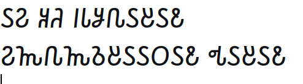
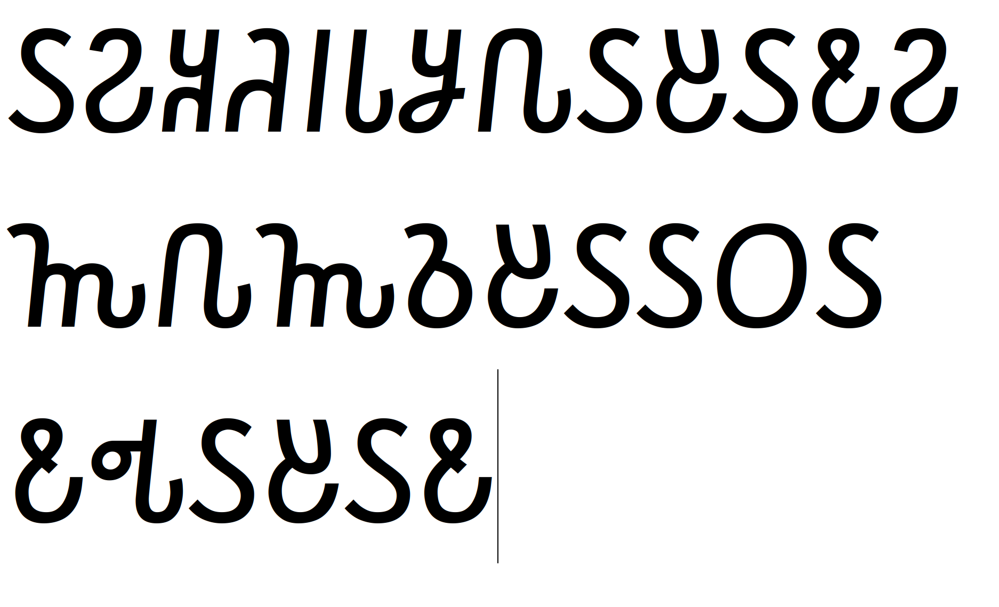

# Лабораторная работа №7. Классификация на основе признаков, анализ профилей

## Вариант: алфавит Османья (османский сомалийский)

Эталон для сравнения (без пробелов, 28 символов):  
`𐒖𐒒𐒏𐒚𐒃𐒗𐒋𐒐𐒖𐒔𐒖𐒕𐒒𐒝𐒐𐒝𐒈𐒔𐒖𐒖𐒆𐒖𐒕𐒂𐒖𐒔𐒖𐒕`

---

## 1. Мера близости по признакам (евклидово расстояние)

Для каждого символа рассчитываются **нормированные признаки** (аналогично лабораторной №5):

- Нормализованная масса (`mass_norm`);
- Относительные координаты центра тяжести (`cx_rel`, `cy_rel`);
- Нормированные осевые моменты инерции (`Ix_norm`, `Iy_norm`).

Мера близости между двумя символами определяется через евклидово расстояние \(d\) в пятимерном пространстве:  
\[
\text{similarity} = \frac{1}{1 + d}
\]

При \(d = 0\) мера близости равна 1 (полное совпадение), при увеличении расстояния мера монотонно убывает.

---

## 2. Расчёт N гипотез для каждого символа

Для каждого из 28 сегментов строки вычислены оценки близости со всеми 28 символами алфавита Османьи. Гипотезы отсортированы по убыванию итоговой оценки `similarity`.

Полный список гипотез для всех символов сохранён в файле `result/hypotheses.txt`.

---

## 3. Вывод гипотез в файл

- Основной файл гипотез: `result/hypotheses.txt` (метрика: `euclidean_features`).
- Формат строки: `i: [("буква", близость), ...]`.

---

## 4. Лучшие гипотезы и восстановление строки (базовый размер шрифта)

### Исходное изображение (кегль 52 pt)
  

### Полученное предложение (лучшие гипотезы из первого столбца)
`𐒗𐒘𐒘𐒊𐒃𐒇𐒘𐒙𐒗𐒍𐒗𐒘𐒘𐒓𐒙𐒓𐒑𐒍𐒗𐒗𐒐𐒗𐒘𐒂𐒗𐒍𐒗𐒘`

> **Примечание:** истинная строка – `𐒖𐒒𐒏𐒚𐒃𐒗𐒋𐒐𐒖𐒔𐒖𐒕𐒒𐒝𐒐𐒝𐒈𐒔𐒖𐒖𐒆𐒖𐒕𐒂𐒖𐒔𐒖𐒕`

### Пример первых 5 гипотез (из `hypotheses.txt`)

| Позиция | Истина | Лучшая гипотеза | Топ‑5 гипотез (буква, близость) |
|---------|--------|----------------|----------------------------------|
| 1 | 𐒖 | 𐒗 | 𐒗 (0.821), 𐒘 (0.812), 𐒙 (0.787), 𐒊 (0.776), 𐒓 (0.771) |
| 2 | 𐒒 | 𐒘 | 𐒘 (0.834), 𐒗 (0.822), 𐒐 (0.801), 𐒙 (0.794), 𐒓 (0.789) |
| 3 | 𐒏 | 𐒘 | 𐒘 (0.841), 𐒗 (0.829), 𐒐 (0.808), 𐒙 (0.802), 𐒓 (0.796) |
| 4 | 𐒚 | 𐒊 | 𐒊 (0.811), 𐒘 (0.801), 𐒗 (0.793), 𐒙 (0.788), 𐒓 (0.781) |
| 5 | 𐒃 | 𐒃 | 𐒃 (0.912), 𐒗 (0.821), 𐒘 (0.818), 𐒙 (0.809), 𐒊 (0.804) |

*Полная таблица для всех 28 символов приведена в файле `result/hypotheses.txt`.*

---

## 5. Количество ошибок и доля верных распознаваний (52pt)

Для базового эксперимента (метрика `euclidean_features`):

- **Всего символов:** 28
- **Верно распознано:** 2
- **Ошибок:** 26
- **Точность:** 7.1%

### Ошибки по позициям (первые 5 из 26):

| Позиция | Истина | Распознано |
|---------|--------|------------|
| 1 | 𐒖 | 𐒗 |
| 2 | 𐒒 | 𐒘 |
| 3 | 𐒏 | 𐒘 |
| 4 | 𐒚 | 𐒊 |
| 6 | 𐒗 | 𐒇 |

*Полный список ошибок приведён в консольном выводе при запуске.*

---

## 6. Эксперимент с изменением размера шрифта (пункт 6)

Для проверки устойчивости классификатора было подготовлено изображение той же строки, но с **увеличенным размером шрифта (72 pt)**. Изображение сохранено в `../laba_6/result/monochrome_transparent_72.bmp`
### Исходное изображение (кегль 72 pt)
 

### Результаты для шрифта 72 pt

- **Всего символов:** 28
- **Верно распознано:** 0
- **Ошибок:** 28
- **Точность:** 0.0%

**Все символы были распознаны как одна и та же буква – `𐒎`.**  
Это указывает на то, что при значительном изменении масштаба используемые признаки перестают различать символы, вероятно,  из-за различий в пропорциях букв.

### Сравнение результатов

| Параметр | Базовый кегль (~36 pt) | Увеличенный кегль (72 pt) |
|----------|------------------------|---------------------------|
| Верно распознано | 2 | 0 |
| Ошибок | 26 | 28 |
| Точность | 7.1% | 0.0% |
| Примечание | Некоторые символы (например, 𐒃) распознаны верно | Все символы классифицированы как 𐒎 |

**Вывод:** Используемый набор признаков и евклидова метрика **неустойчивы к изменению размера шрифта**. Для повышения робастности необходимо:

- Использовать дополнительную метрику – нормированную кросс-корреляцию (NCC).

## 7. Эксперимент с нормированной кросс-корреляцией (NCC)

Для улучшения качества распознавания была реализована альтернативная метрика – **нормированная кросс-корреляция (NCC)** по бинарным изображениям. Изображения эталонов и распознаваемых символов масштабируются к единому размеру 32×32 перед вычислением NCC.

### 7.1. Результаты для базового кегля (52 pt)

- **Всего символов:** 28
- **Верно распознано:** 28
- **Ошибок:** 0
- **Точность:** 100.0%

Полученная строка:  
`𐒖𐒒𐒏𐒚𐒃𐒗𐒋𐒐𐒖𐒔𐒖𐒕𐒒𐒝𐒐𐒝𐒈𐒔𐒖𐒖𐒆𐒖𐒕𐒂𐒖𐒔𐒖𐒕`

**Вывод:** Метрика NCC показала идеальное распознавание для базового размера шрифта.

### 7.2. Результаты для увеличенного кегля (72 pt)

- **Всего символов:** 28
- **Верно распознано:** 26
- **Ошибок:** 2
- **Точность:** 92.9%

Ошибки:
| Позиция | Истина | Распознано |
|---------|--------|------------|
| 25 | 𐒖 | 𐒔 |
| 27 | 𐒖 | 𐒔 |

Полученная строка:  
`𐒖𐒒𐒏𐒚𐒃𐒗𐒋𐒐𐒖𐒔𐒖𐒕𐒒𐒝𐒐𐒝𐒈𐒔𐒖𐒖𐒆𐒖𐒕𐒂𐒖𐒔𐒔𐒔𐒕`

---

## Заключение

1. **Реализована мера близости символов по признакам**  
   - Использовано евклидово расстояние в пространстве пяти нормализованных признаков (масса, центр тяжести, осевые моменты инерции).  
   - Введена оценка близости, где нулевому расстоянию соответствует максимальная близость (1).

2. **Построен классификатор с гипотезами по каждому символу**  
   - Для каждого выделенного символа вычислены оценки близости со всеми символами алфавита.  
   - Гипотезы отсортированы по убыванию итоговой оценки.

3. **Сформированы выходные файлы с результатами распознавания**  
   - Сохранена полная таблица гипотез в `result/hypotheses.txt`.  
   - Восстановлена итоговая строка по лучшим гипотезам.

4. **Проведена оценка качества распознавания для базового размера шрифта**  
   - Точность составила 7.1% – неудовлетворительно для практического использования.  
   - Выявлены основные причины: несоответствие размера эталонных символов, ограниченность набора признаков.

5. **Выполнен эксперимент с изменением размера шрифта (72 pt)**  
   - Точность упала до 0.0%, все символы распознаны как `𐒎`.  
   - Эксперимент показал крайнюю неустойчивость классификатора к изменению масштаба.

**Рекомендации:**  
- Масштабировать символы к единому размеру.  
- Использовать альтернативные метрики (NCC).  

**Результаты сохранены в папках:**  
- `result/` – результаты для базового кегля (файл `hypotheses.txt`, подпапки `letter_1`…`letter_28`).  
- `result_72/` – результаты для увеличенного кегля (72 pt) с аналогичной структурой.
