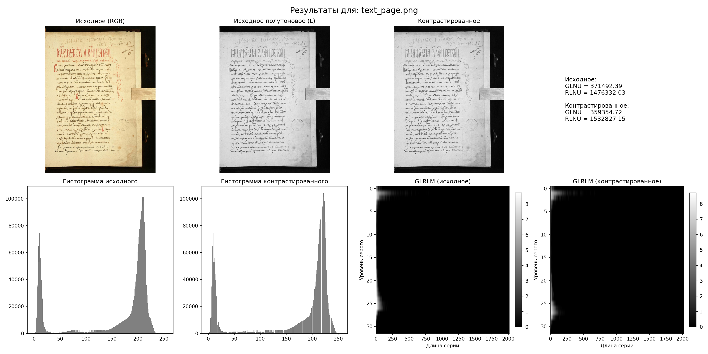

## 1. Лабораторная работа 8. Вариант 8.

## 2. Теоретическая часть

### 2.1. GLRLM (Gray Level Run Length Matrix)
GLRLM — это матрица, в которой элемент \( P(i, j) \) означает количество серий (run) длины \( j \) для уровня серого \( i \). Серия — это последовательность пикселей с одинаковой яркостью вдоль заданного направления.

### 2.2. Текстурные признаки на основе GLRLM

- **GLNU (Gray Level Non‑Uniformity)** — показывает, насколько равномерно распределены серии по уровням серого:
  \[
  \text{GLNU} = \frac{\sum_{i} \left( \sum_{j} P(i,j) \right)^2}{\sum_{i,j} P(i,j)}
  \]
  Чем меньше GLNU, тем более равномерно серии распределены между разными уровнями.

- **RLNU (Run Length Non‑Uniformity)** — показывает, насколько равномерно распределены серии по длинам:
  \[
  \text{RLNU} = \frac{\sum_{j} \left( \sum_{i} P(i,j) \right)^2}{\sum_{i,j} P(i,j)}
  \]
  Чем больше RLNU, тем больше разброс длин серий.

### 2.3. Линейное контрастирование
Преобразование яркости, растягивающее гистограмму до полного диапазона \([0, 255]\):
\[
L_{\text{out}} = \frac{L - \min(L)}{\max(L) - \min(L)} \times 255
\]

### 3. Пример графиков (для `text_page.png`)

На графиках представлены:
- Исходное RGB изображение.
- Исходный канал L (полутоновое).
- Контрастированное полутоновое изображение.
- Гистограммы яркости до и после контрастирования.
- Матрицы GLRLM до и после контрастирования (логарифмический масштаб).

