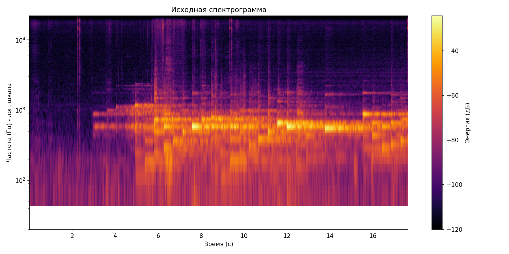
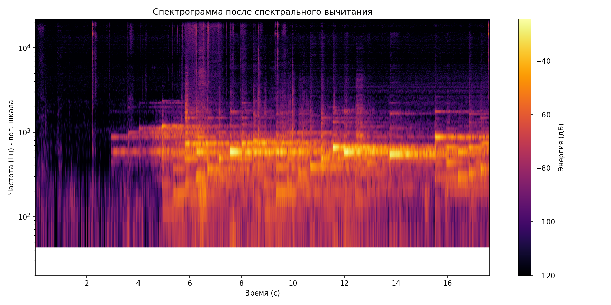
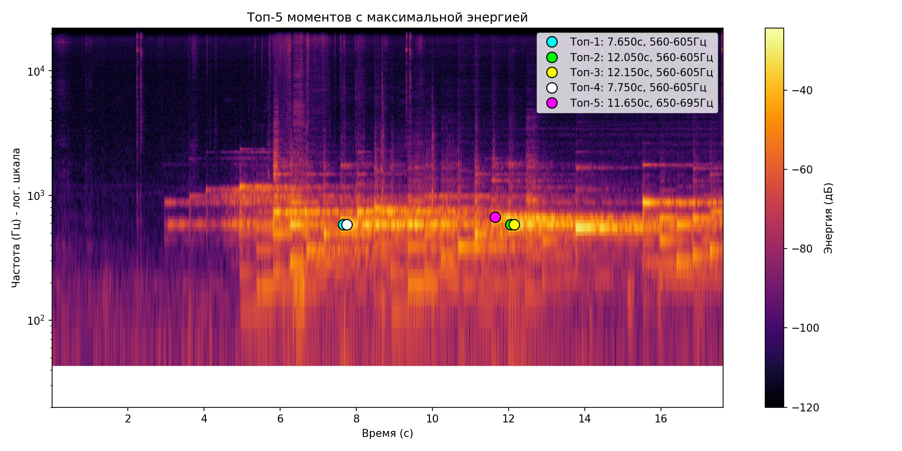

# Лабораторная работа №9. Анализ шума

**Выполнено**: Загрузка, обработка, визуализация и очистка аудиосигнала (`Piano_Music.wav`).

## 1. Исходная спектрограмма
Построена с использованием окна Ханна (nperseg=1024, noverlap=512). Частота выведена на логарифмическую шкалу для детального анализа.

## 2. Оценка шума и его вычитание
Шум был оценён по начальному тихому участку (длительность 0.3 с). Применено **спектральное вычитание** — основной метод очистки. Спектр шума вычтен из исходного, после чего сигнал восстановлен через обратное БПФ.

> *На графике видно, что фоновый шум значительно подавлен, а основная тональная область осталась нетронутой.*

## 3. Поиск моментов с максимальной энергией (Топ-5)
**Параметры поиска:**
- Δt (время) = 0.1 с
- Δf (частота) = 45 Гц

**Результаты:**
1. Время: **7.650 с**, Полоса: **560–605 Гц**
2. Время: **12.050 с**, Полоса: **560–605 Гц**
3. Время: **12.150 с**, Полоса: **560–605 Гц**
4. Время: **7.750 с**, Полоса: **560–605 Гц**
5. Время: **11.650 с**, Полоса: **650–695 Гц**

Маркеры нанесены на исходную спектрограмму:

## 4. Аудиофайлы (воспроизведение)
*Для прослушивания скачайте файлы или используйте встроенный плеер (если ваш браузер поддерживает HTML5 Audio).*

| Версия | Файл |
|--------|------|
| Оригинал (до очистки) | `Piano_Music.wav` |
| Восстановленный (спектральное вычитание) | `restored_spectral_sub.wav` |
| Фильтр Савицкого-Голея | `filtered_savgol.wav` |
| Фильтр Винера | `filtered_wiener.wav` |
| Фильтр низких частот (3000 Гц) | `filtered_lowpass.wav` |

<audio controls>
  <source src="Piano_Music.wav" type="audio/wav">
  Ваш браузер не поддерживает тег audio.
</audio>

## Вывод
Оригинальный звук слушать приятнее всего, все фильры как будто "опускали источник звука под воду".